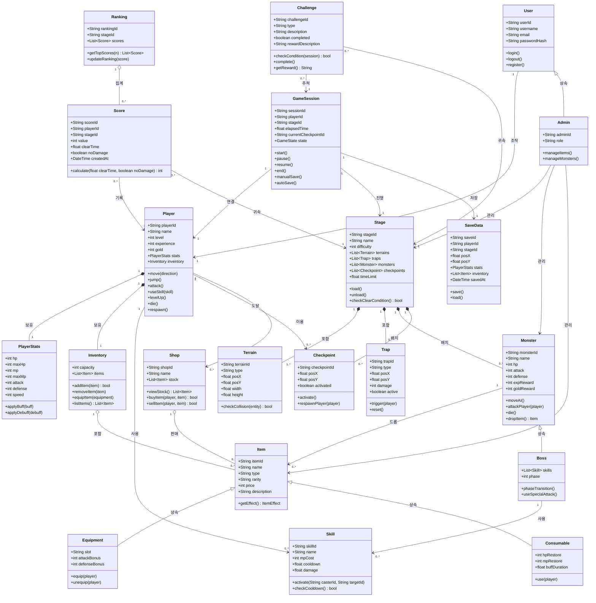
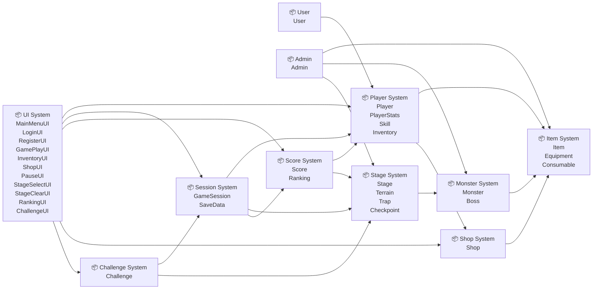

# M3 최종보고서 — Action Game

> 단국대학교 소프트웨어공학 개론 | 2026년 1학기
> 팀: **횡스크롤연구소** | 제출일: 2026-06-21

---

## 목차

1. 프로젝트 개요
2. 팀 구성 및 역할분담
3. 요구사항 정의서 (최종본)
4. WBS 및 프로젝트 일정 (계획 + 실적)
5. 비용 산정 결과
6. 협업 도구 운영 방식
7. UML 다이어그램 (최종본)
8. 인스펙션 결과 (팀 내 Cross-check)
9. 코딩 표준 문서
10. AI 활용 내역 요약
11. 회고 및 개선 사항

---

## 1. 프로젝트 개요

**프로젝트명**

Action Game — 2D 횡스크롤 액션 게임

**배경 및 문제 정의**

기존 캐주얼 액션 게임은 진입 장벽이 낮은 대신 단순 반복으로 흐르고, 본격적인 액션 게임은 학습 곡선이 가파르다는 양극화 문제가 있다. 본 팀은 **짧은 시간 안에 한 스테이지를 클리어할 수 있는 단순한 조작 체계**와 **즉시 재시작 기반의 반복 플레이**를 결합하여, 초보자도 진입할 수 있으면서 숙련 플레이어에게는 실력 기반의 도전감을 제공하는 게임을 목표로 한다.

**목적**

- 좌·우 이동 / 점프 만으로 구성된 직관적인 조작 체계
- 사망 즉시 마지막 체크포인트로 복귀하는 무중단 반복 플레이 루프
- 트랩·지형으로 구성된 1개 스테이지를 통한 학습→숙련 곡선 검증

**예상 사용자**

| 구분 | 특성 |
|------|------|
| 1차 사용자 | 짧은 호흡으로 액션 게임을 즐기려는 학생·일반 게이머 |
| 2차 사용자 | 노 데미지·타임어택 등 도전 과제 기반 실력 향상을 추구하는 플레이어 |

**주요 기능 요약**

| # | 기능명 | 설명 |
|---|--------|------|
| 1 | 캐릭터 조작 | 좌·우 이동, 점프 (입력 후 100ms 이내 반응) |
| 2 | 체크포인트 재시작 | 트랩 접촉·낙사 시 마지막 체크포인트에서 즉시 복귀 |
| 3 | 스테이지 진행 | 지형·트랩·골(Goal)이 배치된 횡스크롤 스테이지 클리어 |
| 4 | 게임 흐름 | 메뉴 → 게임 → STAGE CLEAR → 메뉴 복귀 |
| 5 | 도전 과제 (최종 비전) | 노 데미지·제한 시간 클리어 등 (M3 MVP 범위 외) |

**M1 대비 변경 사항**

- **MVP 스코프 명문화**: M1 단계의 요구사항(회원가입·인벤토리·상점·랭킹 포함)은 "최종 비전"으로 두고, M3 구현 단계에서는 별도 MVP 스펙(`docs/mvp-spec.md`)을 단일 기준으로 확정함. 사유: 5인 팀·3주 구현 일정에 적합하도록 스코프 축소.
- 그 외 핵심 기획(배경·목적·사용자)은 M1과 동일.

---

## 2. 팀 구성 및 역할분담

> 학번은 교수님 공지에 따라 GitHub 공개 저장소 보안을 위해 미기재합니다.

| 이름 | 역할 | 주요 담당 업무 |
|------|------|--------------|
| 이재윤 | PM | 일정·산출물 통합 관리, WBS, MVP 스펙, GitHub 운영 |
| 김남준 | 분석가 | 요구사항 정의, FP 비용 산정, 유스케이스 다이어그램 |
| 김민재 | 설계자 | 클래스 다이어그램, 패키지 다이어그램, 디자인 결정 |
| 김담영 | 개발자 | pygame-ce 기반 구현, 협업 도구 운영, 코딩 표준 |
| 윤원준 | QA / 보안 | 인스펙션 진행, AI 활용 내역 정리, 결함 추적 |

**역할 변경 이력**

| 변경일 | 변경 내용 | 변경 사유 |
|--------|-----------|-----------|
| — | 역할 변경 없음 | M1 확정 역할을 학기 말까지 유지 |

---

## 3. 요구사항 정의서 (최종본)

### 3-1. 기능 요구사항 (FR)

| ID | 요구사항 내용 | 우선순위 | 상태 |
|----|--------------|---------|------|
| FR-01 | 사용자는 입력 후 100ms 안에 캐릭터를 조작할 수 있어야 한다. | 상 | 확정 |
| FR-02 | 사용자는 사망 시 즉시 체크포인트에서 재시작할 수 있어야 한다. | 상 | 확정 |
| FR-03 | 사용자는 반복 플레이를 통해 자신의 조작 숙련도를 향상시킬 수 있어야 한다. | 상 | 확정 |
| FR-04 | 사용자는 다양한 지형과 트랩을 포함한 스테이지를 플레이할 수 있어야 한다. | 중 | 확정 |
| FR-05 | 사용자는 노 데미지 또는 제한시간 내 클리어와 같은 도전 과제를 수행할 수 있어야 한다. | 하 | 확정 (최종 비전, MVP 범위 외) |

### 3-2. 비기능 요구사항 (NFR)

| ID | 품질 특성 | 요구사항 내용 | 우선순위 | 상태 |
|----|-----------|--------------|---------|------|
| NFR-01 | 성능·이식성 | 시스템은 Windows, macOS, Linux에서 원활히 실행될 수 있도록 최소 사양 기준에서 초당 60FPS 이상을 유지하며 메모리 사용량은 1GB 이하로 동작해야 한다. | 상 | 확정 |
| NFR-02 | 사용성 | 시스템은 스테이지 클리어 시 명확한 보상을 제공해야 하며, 보상 획득 과정은 사용자에게 1초 내 인지될 수 있어야 한다. | 상 | 확정 |

### 3-3. M1 대비 변경 이력

| 버전 | 변경일 | 변경 ID | 변경 유형 | 변경 내용 | 변경 사유 |
|------|--------|---------|-----------|-----------|-----------|
| v1.0 | 2026-04-28 | — | 최초 작성 | M1 기획서 기준 FR/NFR 정의 | — |
| v2.0 | 2026-06-10 | FR 전반 | 스코프 분리 | M3 MVP 스코프(`docs/mvp-spec.md`)와 최종 비전을 명시적으로 분리 | 구현 일정 대비 비대해진 요구사항의 현실화 |

---

## 4. WBS 및 프로젝트 일정 (계획 + 실적)

### 4-1. WBS

| # | 단계 | 작업 항목 | 담당자 | 산출물 | 계획 주차 | 실제 완료 주차 | 상태 |
|---|------|-----------|--------|--------|-----------|--------------|------|
| 1 | 기획 | GitHub 레포지토리 개설 및 팀 세팅 | PM | 레포지토리·README | 5주 | 5주 | 완료 |
| 2 | 기획 | 요구사항 정의 | 분석가 | 요구사항 정의서 | 5~6주 | 6주 | 완료 |
| 3 | 기획 | WBS 및 Issue 등록 | PM | WBS 문서 | 6주 | 6주 | 완료 |
| 4 | 기획 | 비용 산정 (간이 FP) | 분석가·PM | FP 산정표 | 7주 | 7주 | 완료 |
| 5 | 기획 | M1 기획서 통합 | PM | M1 기획서 | 8주 | 8주 | 완료 |
| 6 | 설계 | 유스케이스 다이어그램 | 분석가 | UC 다이어그램 | 9주 | 9주 | 완료 |
| 7 | 설계 | 클래스 다이어그램 | 설계자 | 클래스 다이어그램 | 10주 | 10주 | 완료 |
| 8 | 설계 | 패키지 다이어그램 / 디자인 결정 | 설계자 | 패키지 다이어그램 | 11주 | 11주 | 완료 |
| 9 | 설계 | M2 설계 보고서 통합 | PM | M2 설계 보고서 | 12주 | 12주 | 완료 |
| 10 | 구현 | MVP 스펙 확정 | PM | MVP 스펙 문서 | 13주 | 13주 | 완료 |
| 11 | 구현 | 핵심 로직 프로토타입 (Player/Stage/Camera) | 개발자 | 프로토타입 코드 | 13주 | 14주 | 완료 (1주 지연) |
| 12 | 검토 | 팀 내 Cross-check 인스펙션 | QA/보안 | 인스펙션 결과표 | 14주 | 14주 | 완료 |
| 13 | 마무리 | 코딩 표준 문서 | 개발자 | 코딩 표준 | 14주 | 14주 | 완료 |
| 14 | 마무리 | AI 활용 내역 요약 | QA/보안 | AI 활용 요약 | 14주 | 14주 | 완료 |
| 15 | 마무리 | M3 최종 보고서 통합 | PM | M3 최종 보고서 | 15주 | 15주 | 완료 |

### 4-2. 계획 vs 실적 요약

| 항목 | 계획 대비 결과 | 주요 지연 원인 |
|------|--------------|--------------|
| 전체 일정 준수율 | 약 93% (14/15 항목 정시 완료) | — |
| 지연 발생 작업 수 | 1건 | — |
| 주요 지연 항목 | #11 프로토타입 구현 (13주 → 14주) | M1 요구사항 범위를 그대로 구현하려다 일정 부담이 커져, 13주차 중반 MVP 스펙으로 스코프를 재정의하면서 약 1주 지연 발생. 이후 동일한 지연은 발생하지 않음. |

---

## 5. 비용 산정 결과

### 5-1. 최종 간이 FP 산정표

| 기능 유형 | 기능 목록 | 개수 | 가중치 | 소계 |
|-----------|-----------|------|--------|------|
| EI (외부 입력) | 캐릭터 이동 및 점프, 공격 및 스킬 사용, 아이템 획득, 저장/불러오기 | 4 | 3 | 12 |
| EO (외부 출력) | 스테이지 클리어 시스템, 보스전 결과 출력 | 2 | 4 | 8 |
| EQ (외부 조회) | 랭킹 조회, 점수 확인 | 2 | 3 | 6 |
| ILF (내부 논리 파일) | 플레이어 정보, 점수 데이터, 스테이지 정보, 아이템 정보 | 4 | 7 | 28 |
| EIF (외부 인터페이스 파일) | 로그인 기능(외부 계정 연동 가정) | 1 | 5 | 5 |
| **합계** | | **13** | | **59 FP** |

### 5-2. 공수 산정 결과

| 항목 | 내용 |
|------|------|
| 총 FP | 59 FP |
| 적용 생산성 | 12 FP/인월 (학부 간이 기준) |
| 예상 개발 기간 | 약 4.9 인월 |
| 팀 인원 기준 | 5인 / 약 1개월 |

### 5-3. M1 대비 변경 사항

| 항목 | M1 산정값 | M3 최종값 | 변경 사유 |
|------|-----------|-----------|-----------|
| 총 FP | 59 FP | 59 FP | 최종 비전 기준 FR 목록이 동일하게 유지됨 |
| 예상 개발 기간 | 약 4.9 인월 | 약 4.9 인월 | 변경 없음 (단, 실제 M3 구현은 MVP 스코프 기준으로 별도 축소) |

> **참고**: FP 산정은 학기 초의 **최종 비전 FR 전체**를 대상으로 산정한 값이며, M3 단계의 실제 구현 스코프는 MVP 스펙(체크포인트 기반 단일 스테이지)에 한정된다.

---

## 6. 협업 도구 운영 방식

### 6-1. 사용 도구 목록

| 도구 | 용도 | 운영 방식 |
|------|------|-----------|
| GitHub | 코드·문서 버전 관리, Issue·PR 기반 작업 추적 | 모든 산출물(.md 포함)을 `main` 브랜치에 PR로만 머지. 작업 단위로 Issue 발급 후 브랜치명 `feature/<영역>` 사용 |
| GitHub Milestone | M1/M2/M3 마일스톤 추적 | 각 마일스톤별 Issue 묶음, 진행률 가시화 |
| KakaoTalk | 실시간 소통·일정 공유 | 매주 회의 일정 공지·산출물 리뷰 핑 |
| Discord (보이스) | 비동기 회의가 어려운 토픽의 실시간 토의 | 주 1회 정기 회의(60~90분) |
| Claude (웹·CLI) | 문서 정리·다이어그램 변환·베이스라인 코드 생성 | 본 학기 팀 단일 AI 도구. 사용 기록은 `docs/ai-usage-record/`에 개인별 누적 |

### 6-2. 실제 운영 결과

**잘 활용된 점**

- GitHub Issue·Milestone을 WBS와 1:1로 매핑하여, 누가 어떤 작업을 진행 중인지 PM이 별도 보고 없이도 추적 가능했다.
- `docs/` 디렉터리에 산출물을 Markdown으로 통합 관리하여 보고서 작성 시 별도 파일 변환 작업이 거의 없었다.
- AI 사용 기록을 개인별로 분리(`docs/ai-usage-record/<이름>.md`)함으로써, 3원칙(단순 복사 금지·비판적 검증·수정 이력 명시) 추적이 용이했다.

**운영 중 발생한 문제 및 해결 방법**

| 문제 | 원인 | 해결 |
|------|------|------|
| 학기 초 KakaoTalk 단일 채널 운영 시 산출물 논의와 일정 잡담이 섞임 | 채널 분리 부재 | 6주차부터 GitHub Issue 코멘트로 산출물 논의를 옮기고 카톡은 일정·핑 용도로 한정 |
| AI 생성 코드 표기 누락 가능성 | 표기 규칙 미합의 | 13주차 코딩 표준 문서에 `// AI-generated` 주석 규칙 추가 후 `docs/mvp-spec.md`에 명시 |
| M1 요구사항 범위와 실제 구현 가능 범위의 괴리 | 학기 초 스코프 과추정 | 13주차에 MVP 스펙 문서 신설로 "최종 비전 ↔ 구현 스코프" 분리 |

---

## 7. UML 다이어그램 (최종본)

### 7-1. 유스케이스 다이어그램

```mermaid
flowchart LR

%% Actor
Player[플레이어]
Admin[관리자]

%% Player Main
Player --> InformationManage((정보 관리))
Player --> GamePlay((게임 플레이))
Player --> ItemManage((아이템 관리))
Player --> ShopSystem((상점 시스템))
Player --> ScoreSystem((점수 / 랭킹))

%% Information Manage
InformationManage --> Register((회원가입))
InformationManage --> Login((로그인))
InformationManage --> Logout((로그아웃))

%% Game Play
GamePlay --> StartGame((게임 시작))
GamePlay --> Move((이동))
GamePlay --> Attack((공격))
GamePlay --> Skill((스킬 사용))
GamePlay --> KillMonster((몬스터 처치))
GamePlay --> LevelUp((레벨업))
GamePlay --> Checkpoint((체크포인트 재시작))
GamePlay --> Pause((일시정지 / 재개))
GamePlay --> Challenge((도전 과제))
GamePlay --> ManualSave((게임 수동 저장))
GamePlay --> EndGame((게임 종료))

%% Item Manage
ItemManage --> GetItem((아이템 획득))
ItemManage --> Inventory((인벤토리 조회))
ItemManage --> Equip((장비 장착))
ItemManage --> UseItem((아이템 사용))

%% Shop
ShopSystem --> ViewShop((상점 조회))
ShopSystem --> BuyItem((아이템 구매))
ShopSystem --> SellItem((아이템 판매))

%% Score / Ranking
ScoreSystem --> ViewScore((점수 확인))
ScoreSystem --> ViewRanking((랭킹 조회))

%% Admin
Admin --> AdminSystem((관리자 시스템))
AdminSystem --> ItemRegister((아이템 등록))
AdminSystem --> ItemEdit((아이템 수정))
AdminSystem --> ItemDelete((아이템 삭제))
AdminSystem --> MonsterRegister((몬스터 등록))
AdminSystem --> MonsterEdit((몬스터 수정))
AdminSystem --> MonsterDelete((몬스터 삭제))
AdminSystem --> StageAutoSave((게임 자동 저장))
```

**M2 대비 변경 사항**

- "체크포인트 재시작" 유스케이스를 명시적으로 분리하여 FR-02와 1:1로 대응되도록 정리.
- 그 외 액터·유스케이스 구성은 M2 최종본을 유지.

### 7-2. 클래스 다이어그램

**M2 대비 변경 사항**

- `Player`의 `respawn()` 메서드를 추가하여 FR-02(체크포인트 재시작)와의 추적성을 명확히 함.
- `Checkpoint.activate()` / `respawnPlayer()` 시그니처 명시.
- 그 외 클래스 구성은 M2 최종본을 유지.

> **MVP 구현 클래스**: MVP는 `Game`, `Scene`, `MenuScene`, `GameplayScene`, `Player`, `Stage`, `Trap`, `Checkpoint`, `Camera` 의 9개 클래스로 한정한다. 위 다이어그램 중 `User`/`Admin`/`Inventory`/`Item`/`Shop`/`Monster`/`Score`/`Ranking`/`SaveData`/`Challenge` 등은 최종 비전 문서에만 존재하며 본 학기 구현 코드에는 포함되지 않는다. 상세 구분은 [docs/mvp-spec.md](docs/mvp-spec.md) 참조.

### 7-3. 패키지 다이어그램

**M2 대비 변경 사항**

- 인스펙션 반영으로 `UISystem` 패키지에 `LoginUI`, `RegisterUI`를 추가하여 [UI 설계서](docs/ui.md) UI-02, UI-03과 일치시킴.
- 그 외 패키지 구성은 M2 최종본을 유지.

> **MVP 구현 패키지**: MVP는 Player System(`Player`), Stage System(`Stage`, `Trap`, `Checkpoint`), `Camera`, `Scene` 계열만 사용한다. 그 외 패키지는 최종 비전 문서에만 존재한다.

---

## 8. 인스펙션 결과 (팀 내 Cross-check)

### 8-1. 검토 개요

| 항목 | 내용 |
|------|------|
| 검토 일시 | 2026-06-11 (14주차) |
| 검토 방식 | 팀 내 역할 교환 Cross-check (분석가↔개발자, 설계자↔QA/보안, PM 산출물은 전원) |
| 검토 산출물 | 요구사항 정의서, 유스케이스/클래스 다이어그램, MVP 스펙, WBS, 코딩 표준, AI 활용 내역 |
| 검토 참여 인원 | 5명 전원 |

### 8-2. 역할별 교차 검토 결과

| 검토 방향 | 검토자 | 검토 항목 | 발견된 결함 | 심각도 | 수정 여부 |
|-----------|--------|-----------|------------|--------|-----------|
| 분석가 산출물 → | 개발자 | 요구사항 정의서·유스케이스·FP 산정 | (1) FR-05 "도전 과제"가 MVP에 포함되는지 모호 (2) FP 산정의 EIF가 MVP에는 해당 없음 | 중 / 하 | 부분 수정 |
| 설계자 산출물 → | QA/보안 | 클래스/패키지 다이어그램 | (1) `User`·`Admin`이 MVP에 포함되지 않음에도 동일 비중으로 표현되어 혼동 가능 (2) `GameSession`의 책임 과중 | 중 / 중 | 부분 수정 |
| 개발자 산출물 → | 분석가 | 코딩 표준 문서, 협업 도구 운영 방식 | (1) AI 생성 코드 표기(`// AI-generated`)가 코딩 표준에는 있으나 협업 도구 절에 미연계 | 하 | 수정 |
| QA/보안 산출물 → | 설계자 | 인스펙션 결과 기록, AI 활용 내역 요약 | (1) 인스펙션 결함 심각도 표기가 일부 누락 (2) "AI가 설계 품질에 미친 영향" 단락 부재 | 중 / 중 | 수정 |
| PM 산출물 → | 전원 | 프로젝트 개요·WBS·MVP 스펙·최종 보고서 | (1) WBS 실적 컬럼 일부 미기입 (2) MVP IN/OUT 경계가 보고서 본문과 MVP 스펙 사이에서 일관되지 않음 | 중 / 중 | 수정 |

### 8-3. 검토 결과 반영 요약

| # | 검토 항목 | 지적 내용 | 반영 여부 | 비고 |
|---|-----------|-----------|-----------|------|
| 1 | FR-05 MVP 포함 여부 | 본 문서 §1 주요 기능 요약 및 §3 요구사항 표에 "최종 비전, MVP 범위 외" 명시 | 반영 | — |
| 2 | FP 산정의 EIF | MVP 스코프에는 EIF 없음을 §5-1 하단 주석으로 명시 | 반영 | FP 표 자체는 최종 비전 기준 유지 |
| 3 | 클래스 다이어그램과 MVP 구현 범위의 괴리 | §7-2 하단에 MVP 구현 클래스 7개 명시 | 반영 | — |
| 4 | `GameSession` 책임 과중 | 후속 단계 과제로 이관 (M3 MVP에는 미사용) | 미반영 (사유 기록) | MVP에서 사용하지 않으므로 우선순위 하 |
| 5 | AI 생성 코드 표기 운영 연계 | §6 협업 도구 운영 방식에 `// AI-generated` 표기 합의를 명시 | 반영 | — |
| 6 | 인스펙션 심각도 표기 누락 | §8-2 표에 심각도 컬럼을 정비하여 모든 행에 기입 | 반영 | — |
| 7 | AI가 설계 품질에 미친 영향 | §10-5 단락 신설 | 반영 | — |
| 8 | WBS 실적 컬럼 누락 | §4-1 실적 컬럼 전면 보완 | 반영 | — |
| 9 | MVP IN/OUT 일관성 | 본 보고서 전체에서 "최종 비전 / MVP 스코프"를 동일 표현으로 통일 | 반영 | — |

> 상세 체크리스트는 [docs/inspection-checklist.md] 양식을 따른다. (제출 시 별첨)

---

## 9. 코딩 표준 문서

| 항목 | 적용 기준 |
|------|-----------|
| 언어·버전 | Python 3.11+ |
| 명명 규칙 — 클래스 | PascalCase (예: `Player`, `GameplayScene`, `Checkpoint`) |
| 명명 규칙 — 함수·메서드·변수 | snake_case (Python 표준, 예: `handle_input`, `on_ground`) |
| 명명 규칙 — 상수 | UPPER_SNAKE_CASE (예: `SCREEN_WIDTH`, `JUMP_VELOCITY`) — `src/settings.py`에 집중 |
| 들여쓰기 | 스페이스 4칸 (탭 금지) |
| 줄 길이 | 100자 권장, 120자 초과 금지 |
| 임포트 순서 | 표준 라이브러리 → 서드파티(pygame, pytmx) → 프로젝트 내부 모듈 (각 블록 사이 한 줄 공백) |
| 타입 힌트 | public 메서드 시그니처에는 타입 힌트 필수 (MVP 스펙 §7 참조) |
| 주석 규칙 | WHY를 설명할 때만 작성. WHAT은 코드와 식별자로 표현 |
| AI 생성 코드 표기 | AI가 생성한 코드 블록 상단에 `# AI-generated` 주석 추가. 팀이 수정한 경우 `# AI-generated, modified by <이름>`로 갱신 |
| 파일 구조 | MVP 스펙 §4 폴더 구조 준수. 새 파일 생성은 PM에게 사전 공유 |
| 단위 / 시간 | 모든 이동·물리 연산은 dt 기반(`pos += velocity * dt`). 프레임 종속 코드 금지 |
| 좌표계 | 화면 좌상단 (0, 0), x→오른쪽, y→아래로 통일 |
| 브랜치 / 머지 | `feature/<영역>` 브랜치, `main` 직접 push 금지, PR 리뷰 1인 이상 후 머지 |
| 머지 전 체크 | `python src/main.py` 실행 성공, MVP OUT 항목 미포함 확인 |

---

## 10. AI 활용 내역 요약

### 10-1. 팀 전체 AI 활용 현황

| 항목 | 내용 |
|------|------|
| 총 활용 횟수 (추정) | 약 80~100회 (팀원 5인 합산) |
| 주요 사용 도구 | **Claude (Anthropic)** — 웹 채팅 및 Claude Code(CLI). 본 학기 팀 단일 AI 도구 |
| 가장 많이 활용한 단계 | 설계(M2): 다이어그램 변환·구조 검토 / 구현(M3): MVP 스펙 작성 및 베이스라인 코드 생성 |

### 10-2. 단계별 활용 내역

| 단계 | 주요 활용 내용 | 활용 도구 | 팀 수정 여부 |
|------|--------------|-----------|------------|
| 기획 (M1) | 요구사항 docx→Markdown 변환, FR/NFR 형식 통일, FP 분류 초안, WBS 표 생성 | Claude (웹) | 수정 (FR/NFR 재분류, 측정 가능 표현으로 수정) |
| 설계 (M2) | 유스케이스/클래스/패키지 다이어그램의 Mermaid 변환, SRP 관점 구조 검토 | Claude (웹) | 수정 (유스케이스명 형식 통일, 클래스 책임 재분배) |
| 구현·검토 (M3) | MVP 스펙 문서 구조화, pygame-ce 베이스라인 스켈레톤 코드 생성, 코딩 표준 초안, 인스펙션 체크리스트 적용 | Claude (웹·CLI) | 수정 (OUT 목록 차단 후 재생성, 실행 검증 후 import 경로 수정) |

### 10-3. AI 활용 3원칙 준수 자체 평가

| 원칙 | 준수 여부 | 비고 |
|------|-----------|------|
| 단순 복사 금지 | 준수 | 모든 AI 결과물에 대해 최소 1회 이상 팀 검토·수정. 개인 AI 로그에 수정 이력 기록 |
| 비판적 검증 | 준수 | 분류·구조·스코프 측면에서 AI 결과를 직접 점검. 특히 MVP OUT 항목을 AI가 관행적으로 포함시키려 한 경우 명시적으로 차단 |
| 수정 이력 명시 | 준수 | `docs/ai-usage-record/<이름>.md`에 건별 프롬프트·비판적 검토·수정 내용을 누적 기록 |

### 10-4. 가장 효과적이었던 AI 활용 사례

**사례: MVP 스펙 문서 작성 (13주차, PM)**

- **상황**: M1 요구사항·M2 클래스 다이어그램이 비대해져 개발자가 "어디까지가 구현 범위인가"를 매번 질문하는 비효율 발생.
- **활용 방식**: Claude에 "최종 비전 문서는 그대로 두고, 구현 단계에서 AI에 시킬 작업과 시키지 말아야 할 작업을 명시한 단일 기준 문서를 만들고 싶다"고 요청.
- **결과**: IN/OUT 스코프 + 기술 스택 + 폴더 구조 + Definition of Done이 포함된 `docs/mvp-spec.md` 초안이 1회의 프롬프트로 생성. 팀이 OUT 목록(사운드·멀티 스테이지 등)을 조정한 후 확정.
- **효과**: 이후 AI 코드 요청 시 이 문서를 항상 첨부하는 규칙을 도입하여, 베이스라인 코드의 스코프 일탈이 눈에 띄게 줄어듦.

### 10-5. AI 활용의 한계 또는 주의가 필요했던 사례

**사례 1: 베이스라인 코드 생성 시 OUT 항목 자동 포함 (13주차, 개발자·PM)**

- AI가 학습 패턴에 따라 `inventory.py`, `save_manager.py` 등 MVP OUT으로 명시된 파일을 "일반적인 게임 프로젝트 구조"로 자동 생성.
- 1차 지시("OUT 목록은 포함하지 말 것")로는 부족했고, 2차 지시("OUT 목록의 파일은 만들지 마")까지 가야 제거됨.
- **교훈**: 스코프 통제는 AI가 아닌 팀의 책임. OUT 목록은 한 번에 안 되면 명시적으로 재차단해야 한다.

**사례 2: 유스케이스 다이어그램 Mermaid 변환 시 문법 오선택 (9주차, 분석가·PM)**

- AI가 첫 응답에서 `classDiagram` 문법을 사용해 GitHub에서 렌더링 실패.
- 재요청 후 `flowchart` 기반으로 변경되어 해결.
- **교훈**: 출력 형식(렌더 환경 포함)을 프롬프트에 명시하지 않으면 검증 비용이 발생한다.

**AI가 설계 품질에 미친 영향 (긍정 / 부정)**

- **긍정**: 클래스 다이어그램 작성 시 SRP 관점 검토를 즉시 받아볼 수 있어 `SceneManager` 분리 등의 개선이 가능했다. Mermaid 변환·표 정리 등 형식 작업 시간을 크게 줄여 팀이 "내용 결정"에 더 많은 시간을 쓸 수 있었다.
- **부정**: AI가 "일반적인 게임 프로젝트 구조"를 자동으로 채워 넣으려는 경향이 있어, 명시적으로 OUT을 차단하지 않으면 스코프가 부풀려진다. 또한 일부 분류(EI/EO 등 FP 유형)에서 도메인 맥락을 잘못 잡는 경우가 있어, 사람의 재분류가 반드시 필요했다.

---

## 11. 회고 및 개선 사항

### 11-1. 팀 전체 회고

**잘된 점**

- M1 단계에서 GitHub Issue·Milestone 운영을 일찍 정착시켜, 학기 내내 작업 추적이 끊기지 않았다.
- 13주차에 MVP 스펙 문서를 신설하여 "최종 비전 ↔ 구현 스코프"를 분리한 것이 후반 작업의 혼선을 크게 줄였다.
- AI 사용 기록을 개인별 누적 파일로 분리해, 3원칙 준수 여부를 객관적으로 확인할 수 있었다.

**아쉬운 점**

- 13주차에 프로토타입 구현이 1주 지연된 근본 원인은 M1 요구사항을 그대로 구현하려 한 데 있었다. 스코프 축소 시점을 더 빨리 잡았다면 지연을 막을 수 있었다.
- 회의록 양식이 학기 후반에 일관되지 않았다. 작성자 분리·합의 사항 표기 양식을 초기에 못 박았어야 했다.
- AI 활용의 "비판적 검증" 항목이 개인별 편차가 있었다. 팀 차원의 검증 체크리스트가 있었다면 더 균일했을 것이다.

**배운 점**

- 요구사항·다이어그램 같은 산출물은 "정확히 무엇을 만들지"보다 "무엇을 만들지 않을지"를 먼저 정해야 작업이 수렴된다.
- AI는 형식·구조화 작업에서 매우 강하지만, 스코프 결정·도메인 분류·가치 판단에서는 사람의 책임이 더 분명해야 한다.
- 한 학기짜리 프로젝트에서는 "완벽한 비전" 대비 "동작하는 작은 MVP"를 먼저 확정하는 것이 일정·품질 모두에 유리하다.

**다음에 다시 한다면**

- 학기 초(5~6주차) 시점부터 "M3 시점의 MVP 스코프"를 별도 문서로 잡고 시작한다.
- 코딩 표준·AI 생성 코드 표기 규칙을 구현 시작 전에 합의한다.
- 인스펙션 체크리스트를 13주차가 아닌 11주차에 미리 배포해, 작성자가 체크리스트를 의식하며 산출물을 마무리하게 한다.

### 11-2. 팀원별 소감

| 이름 | 역할 | 한 줄 소감 |
|------|------|-----------|
| 이재윤 | PM | 일정과 산출물 통합 관리의 무게를 체감했지만, MVP 스펙 문서를 통해 팀의 방향을 한 줄로 정렬할 수 있어 보람 있었다. |
| 김남준 | 분석가 | 요구사항을 "측정 가능한 문장"으로 다듬는 훈련이 가장 큰 수확이었다. |
| 김민재 | 설계자 | 비전 다이어그램과 MVP 구현 범위를 분리해서 그리는 경험이 실무 감각에 도움이 됐다. |
| 김담영 | 개발자 | 코딩 표준과 dt 기반 물리 같은 작은 원칙이 협업 속도를 얼마나 좌우하는지 알게 됐다. |
| 윤원준 | QA / 보안 | 인스펙션을 "결함 찾기"가 아니라 "산출물 간 일관성 검증"으로 보는 시각을 얻었다. |

---

## 제출 체크리스트

- [x] 1. 프로젝트 개요 — 최종본 기준 업데이트 완료
- [x] 2. 팀 구성 및 역할분담 — 역할 변경 이력 포함
- [x] 3. 요구사항 정의서 — 최종본 + 변경 이력 포함 (FR 5↑, NFR 2↑)
- [x] 4. WBS — 계획 + 실적 비교 포함
- [x] 5. 비용 산정 — 최종 FP 결과 + M1 대비 비교
- [x] 6. 협업 도구 운영 방식 — 실제 운영 내용 기술
- [x] 7. UML 다이어그램 — Mermaid 코드블록 작성 완료
- [x] 8. 인스펙션 결과 — 역할 교환 Cross-check 결과 + 반영 여부 포함
- [x] 9. 코딩 표준 — 명명 규칙 등 주요 항목 포함
- [x] 10. AI 활용 내역 — 단계별 요약 + 자체 평가 포함
- [x] 11. 회고 — 팀 전체 회고 + 팀원별 소감 포함
- [x] 전체 일관성 점검 완료 (요구사항 ID, 팀명 통일)
- [x] 파일명: `M3_최종보고서_ActionGame.md`
- [ ] GitHub 저장소에 업로드 완료 (제출 시 커밋·푸시)

---

*관련 문서: [요구사항](docs/requirements.md), [WBS](docs/wbs.md), [FP 산정](docs/FP_estimation.md), [유스케이스](docs/usecase.md), [클래스 다이어그램](docs/classdiagram.md), [패키지 다이어그램](docs/PackageDiagram.md), [MVP 스펙](docs/mvp-spec.md), [UI 설계서](docs/ui.md), [AI 활용 로그(PM)](docs/ai-usage-record/M3_AI로그_이재윤.md)*
