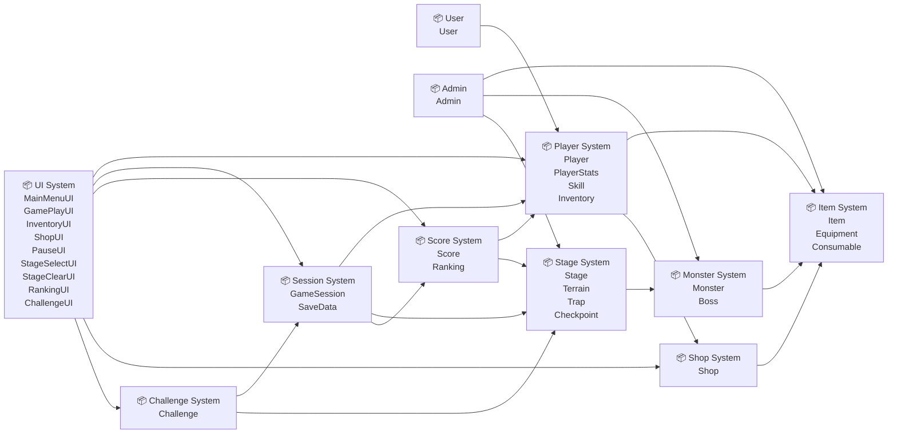

```mermaid
flowchart LR

%% =========================
%% Packages
%% =========================

UserPackage["📦 User\nUser"]

AdminPackage["📦 Admin\nAdmin"]

PlayerSystem["📦 Player System\nPlayer\nPlayerStats\nSkill\nInventory"]

ItemSystem["📦 Item System\nItem\nEquipment\nConsumable"]

StageSystem["📦 Stage System\nStage\nTerrain\nTrap\nCheckpoint"]

MonsterSystem["📦 Monster System\nMonster\nBoss"]

ShopSystem["📦 Shop System\nShop"]

ScoreSystem["📦 Score System\nScore\nRanking"]

SessionSystem["📦 Session System\nGameSession\nSaveData"]

ChallengeSystem["📦 Challenge System\nChallenge"]

UISystem["📦 UI System\nMainMenuUI\nGamePlayUI\nInventoryUI\nShopUI\nPauseUI\nStageSelectUI\nStageClearUI\nRankingUI\nChallengeUI"]

%% =========================
%% Dependencies
%% =========================

UserPackage --> PlayerSystem

AdminPackage --> ItemSystem
AdminPackage --> MonsterSystem
AdminPackage --> StageSystem

PlayerSystem --> ItemSystem
PlayerSystem --> ShopSystem

MonsterSystem --> ItemSystem

StageSystem --> MonsterSystem

ShopSystem --> ItemSystem

ScoreSystem --> PlayerSystem
ScoreSystem --> StageSystem

SessionSystem --> PlayerSystem
SessionSystem --> StageSystem
SessionSystem --> ScoreSystem

ChallengeSystem --> SessionSystem
ChallengeSystem --> StageSystem

UISystem --> PlayerSystem
UISystem --> SessionSystem
UISystem --> ScoreSystem
UISystem --> ShopSystem
UISystem --> ChallengeSystem
```

*최종 수정: 2026-06-02 | 담당: 김민재(설계자)*
