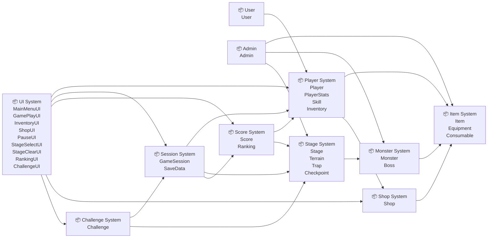

> **알림**: 이 문서는 프로젝트의 최종 비전을 기록한 것입니다.
> MVP 구현 단계의 스코프는 [mvp-spec.md](mvp-spec.md)를 따릅니다. 이 문서의 모든 항목이 MVP에 포함되는 것은 아니며, AI에 이 문서를 그대로 첨부하면 MVP 범위를 벗어난 코드(인증, 상점, 인벤토리, 점수, 세이브 등)가 생성될 수 있습니다.

---

*최종 수정: 2026-06-02 | 담당: 김민재(설계자)*
