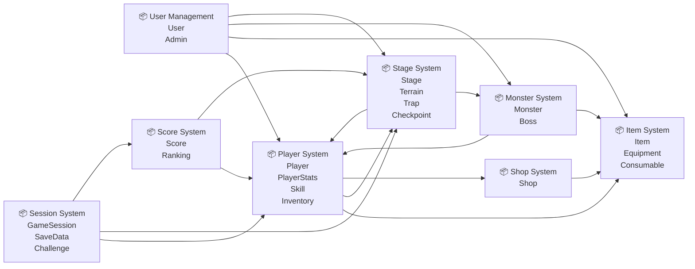

```mermaid
flowchart LR

%% =========================
%% Packages
%% =========================

UserManagement["📦 User Management<br/>User<br/>Admin"]

PlayerSystem["📦 Player System<br/>Player<br/>PlayerStats<br/>Skill<br/>Inventory"]

ItemSystem["📦 Item System<br/>Item<br/>Equipment<br/>Consumable"]

StageSystem["📦 Stage System<br/>Stage<br/>Terrain<br/>Trap<br/>Checkpoint"]

MonsterSystem["📦 Monster System<br/>Monster<br/>Boss"]

ShopSystem["📦 Shop System<br/>Shop"]

ScoreSystem["📦 Score System<br/>Score<br/>Ranking"]

SessionSystem["📦 Session System<br/>GameSession<br/>SaveData<br/>Challenge"]

%% =========================
%% Dependencies
%% =========================

UserManagement --> PlayerSystem

PlayerSystem --> ItemSystem
PlayerSystem --> StageSystem
PlayerSystem --> ShopSystem

MonsterSystem --> PlayerSystem
MonsterSystem --> ItemSystem

StageSystem --> MonsterSystem
StageSystem --> PlayerSystem

ShopSystem --> ItemSystem

ScoreSystem --> PlayerSystem
ScoreSystem --> StageSystem

SessionSystem --> PlayerSystem
SessionSystem --> StageSystem
SessionSystem --> ScoreSystem

UserManagement --> ItemSystem
UserManagement --> MonsterSystem
UserManagement --> StageSystem
```
