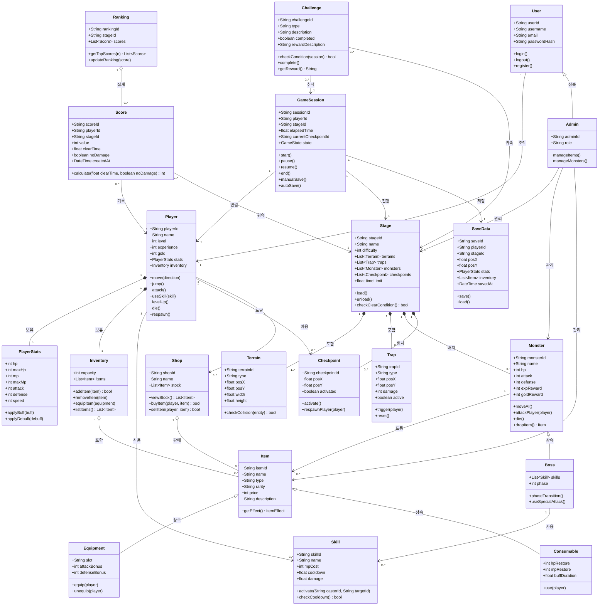

```mermaid
classDiagram

%% ────────────────────────────────────────────────
%%  사용자 / 인증
%% ────────────────────────────────────────────────
class User {
  +String userId
  +String username
  +String email
  +String passwordHash
  +login()
  +logout()
  +register()
}

class Admin {
  +String adminId
  +String role
  +manageItems()
  +manageMonsters()
}

%% ────────────────────────────────────────────────
%%  플레이어 & 스탯
%% ────────────────────────────────────────────────
class Player {
  +String playerId
  +String name
  +int level
  +int experience
  +int gold
  +PlayerStats stats
  +Inventory inventory
  +move(direction)
  +jump()
  +attack()
  +useSkill(skill)
  +levelUp()
  +die()
  +respawn()
}

class PlayerStats {
  +int hp
  +int maxHp
  +int mp
  +int maxMp
  +int attack
  +int defense
  +int speed
  +applyBuff(buff)
  +applyDebuff(debuff)
}

class Checkpoint {
  +String checkpointId
  +float posX
  +float posY
  +boolean activated
  +activate()
  +respawnPlayer(player)
}

%% ────────────────────────────────────────────────
%%  스킬
%% ────────────────────────────────────────────────
class Skill {
  +String skillId
  +String name
  +int mpCost
  +float cooldown
  +float damage
  +activate(String casterId, String targetId)
  +checkCooldown() bool
}

%% ────────────────────────────────────────────────
%%  스테이지 & 맵
%% ────────────────────────────────────────────────
class Stage {
  +String stageId
  +String name
  +int difficulty
  +List~Terrain~ terrains
  +List~Trap~ traps
  +List~Monster~ monsters
  +List~Checkpoint~ checkpoints
  +float timeLimit
  +load()
  +unload()
  +checkClearCondition() bool
}

class Terrain {
  +String terrainId
  +String type
  +float posX
  +float posY
  +float width
  +float height
  +checkCollision(entity) bool
}

class Trap {
  +String trapId
  +String type
  +float posX
  +float posY
  +int damage
  +boolean active
  +trigger(player)
  +reset()
}

%% ────────────────────────────────────────────────
%%  몬스터
%% ────────────────────────────────────────────────
class Monster {
  +String monsterId
  +String name
  +int hp
  +int attack
  +int defense
  +int expReward
  +int goldReward
  +moveAI()
  +attackPlayer(player)
  +die()
  +dropItem() Item
}

class Boss {
  +List~Skill~ skills
  +int phase
  +phaseTransition()
  +useSpecialAttack()
}

%% ────────────────────────────────────────────────
%%  아이템 & 인벤토리
%% ────────────────────────────────────────────────
class Item {
  +String itemId
  +String name
  +String type
  +String rarity
  +int price
  +String description
  +getEffect() ItemEffect
}

class Equipment {
  +String slot
  +int attackBonus
  +int defenseBonus
  +equip(player)
  +unequip(player)
}

class Consumable {
  +int hpRestore
  +int mpRestore
  +float buffDuration
  +use(player)
}

class Inventory {
  +int capacity
  +List~Item~ items
  +addItem(item) bool
  +removeItem(item)
  +equipItem(equipment)
  +listItems() List~Item~
}

%% ────────────────────────────────────────────────
%%  상점 & 거래
%% ────────────────────────────────────────────────
class Shop {
  +String shopId
  +String name
  +List~Item~ stock
  +viewStock() List~Item~
  +buyItem(player, item) bool
  +sellItem(player, item) bool
}

%% ────────────────────────────────────────────────
%%  점수 & 랭킹
%% ────────────────────────────────────────────────
class Score {
  +String scoreId
  +String playerId
  +String stageId
  +int value
  +float clearTime
  +boolean noDamage
  +DateTime createdAt
  +calculate(float clearTime, boolean noDamage) int
}

class Ranking {
  +String rankingId
  +String stageId
  +List~Score~ scores
  +getTopScores(n) List~Score~
  +updateRanking(score)
}

%% ────────────────────────────────────────────────
%%  게임 세션 & 저장
%% ────────────────────────────────────────────────
class GameSession {
  +String sessionId
  +String playerId
  +String stageId
  +float elapsedTime
  +String currentCheckpointId
  +GameState state
  +start()
  +pause()
  +resume()
  +end()
  +manualSave()
  +autoSave()
}

class SaveData {
  +String saveId
  +String playerId
  +String stageId
  +float posX
  +float posY
  +PlayerStats stats
  +List~Item~ inventory
  +DateTime savedAt
  +save()
  +load()
}

%% ────────────────────────────────────────────────
%%  도전과제 (Challenge)
%% ────────────────────────────────────────────────
class Challenge {
  +String challengeId
  +String type
  +String description
  +boolean completed
  +String rewardDescription
  +checkCondition(session) bool
  +complete()
  +getReward() String
}

%% ────────────────────────────────────────────────
%%  관계 정의
%% ────────────────────────────────────────────────
User "1" --> "1" Player : 조작
User <|-- Admin : 상속

Player "1" *-- "1" PlayerStats : 보유
Player "1" *-- "1" Inventory : 보유
Player "1" --> "0..*" Skill : 사용
Player "1" --> "0..*" Checkpoint : 도달

Inventory "1" o-- "0..*" Item : 포함
Item <|-- Equipment : 상속
Item <|-- Consumable : 상속

Monster "1" --> "0..*" Item : 드롭
Monster <|-- Boss : 상속
Boss "1" --> "0..*" Skill : 사용

Stage "1" *-- "1..*" Terrain : 포함
Stage "1" *-- "0..*" Trap : 포함
Stage "1" *-- "0..*" Monster : 배치
Stage "1" *-- "0..*" Checkpoint : 배치

Shop "1" o-- "0..*" Item : 판매
Player "1" --> "0..*" Shop : 이용

GameSession "1" --> "1" Player : 연결
GameSession "1" --> "1" Stage : 진행
GameSession "1" --> "1" SaveData : 저장

Score "0..*" --> "1" Player : 기록
Score "0..*" --> "1" Stage : 귀속
Ranking "1" o-- "0..*" Score : 집계

Challenge "0..*" --> "1" GameSession : 추적
Challenge "0..*" --> "1" Stage : 귀속
Admin --> Stage : 관리
Admin --> Monster : 관리
Admin --> Item : 관리
```

*최종 수정: 2026-06-02 | 담당: 김남준(분석가)*
