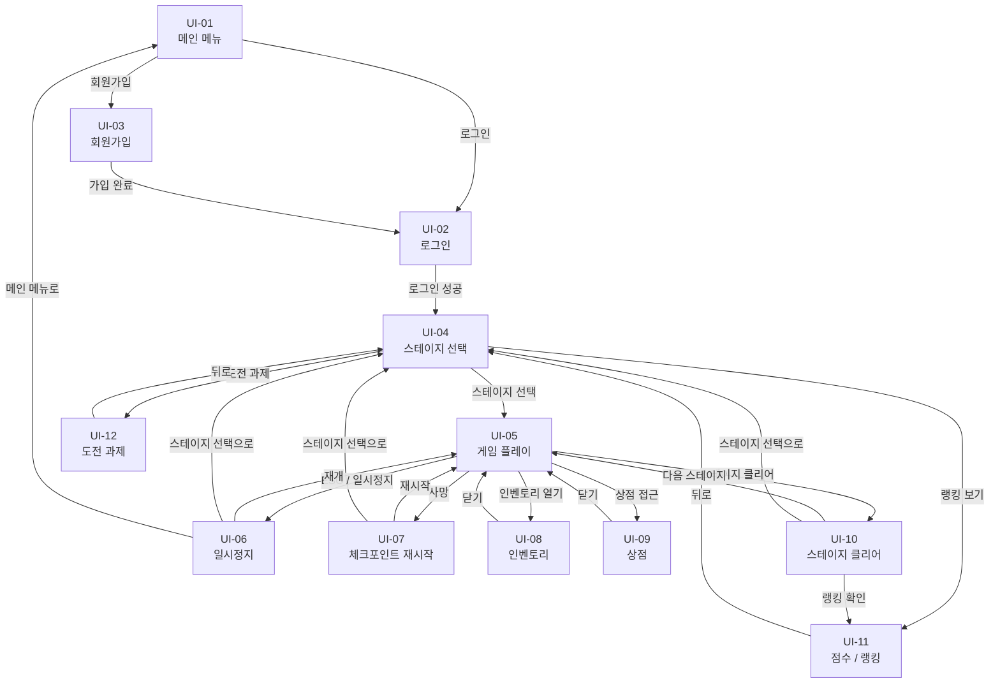

# 유저 인터페이스 설계서

## 1. 화면 목록

| ID | 화면명 | 설명 |
|----|--------|------|
| UI-01 | 메인 메뉴 | 게임 시작 및 로그인/회원가입 진입점 |
| UI-02 | 로그인 | 계정 로그인 화면 |
| UI-03 | 회원가입 | 신규 계정 생성 화면 |
| UI-04 | 스테이지 선택 | 플레이할 스테이지 선택 화면 |
| UI-05 | 게임 플레이 | 실제 게임 진행 화면 (HUD 포함) |
| UI-06 | 일시정지 | 게임 중 일시정지 오버레이 |
| UI-07 | 체크포인트 재시작 | 사망 시 재시작 확인 오버레이 |
| UI-08 | 인벤토리 | 아이템 보유 목록 및 장비 관리 |
| UI-09 | 상점 | 아이템 구매 및 판매 |
| UI-10 | 스테이지 클리어 | 클리어 결과 및 점수 표시 |
| UI-11 | 점수 / 랭킹 | 스테이지별 랭킹 조회 |
| UI-12 | 도전 과제 | 도전 과제 목록 및 달성 현황 |

---

## 2. 화면 간 전환 흐름



---

## 3. 화면별 상세 설계

### UI-01 메인 메뉴

```
┌─────────────────────────────────┐
│                                 │
│         ACTION GAME             │
│                                 │
│      [ 로그인         ]         │
│      [ 회원가입       ]         │
│      [ 종료           ]         │
│                                 │
└─────────────────────────────────┘
```

| 구성 요소 | 설명 |
|-----------|------|
| 게임 타이틀 | 화면 상단 중앙 |
| 로그인 버튼 | UI-02로 이동 |
| 회원가입 버튼 | UI-03으로 이동 |
| 종료 버튼 | 게임 종료 |

---

### UI-02 로그인

```
┌─────────────────────────────────┐
│           로그인                │
│                                 │
│  아이디  [ ______________ ]     │
│  비밀번호[ ______________ ]     │
│                                 │
│      [ 로그인  ] [ 취소 ]       │
│                                 │
│      회원가입 하러 가기 →       │
└─────────────────────────────────┘
```

| 구성 요소 | 설명 |
|-----------|------|
| 아이디 입력 필드 | 텍스트 입력 |
| 비밀번호 입력 필드 | 마스킹 처리 |
| 로그인 버튼 | 인증 후 UI-04로 이동 |
| 취소 버튼 | UI-01로 복귀 |
| 회원가입 링크 | UI-03으로 이동 |

---

### UI-03 회원가입

```
┌─────────────────────────────────┐
│           회원가입              │
│                                 │
│  아이디  [ ______________ ]     │
│  비밀번호[ ______________ ]     │
│  이메일  [ ______________ ]     │
│                                 │
│      [ 가입 완료 ] [ 취소 ]     │
└─────────────────────────────────┘
```

| 구성 요소 | 설명 |
|-----------|------|
| 아이디 / 비밀번호 / 이메일 입력 | 텍스트 입력 |
| 가입 완료 버튼 | 계정 생성 후 UI-02로 이동 |
| 취소 버튼 | UI-01로 복귀 |

---

### UI-04 스테이지 선택

```
┌─────────────────────────────────┐
│  스테이지 선택          [랭킹]  │
├──────────┬──────────┬───────────┤
│ Stage 1  │ Stage 2  │ Stage 3   │
│ ★★★☆☆  │ ★★☆☆☆  │  🔒       │
│ [선택]   │ [선택]   │           │
├──────────┴──────────┴───────────┤
│  [도전 과제]        [메인 메뉴] │
└─────────────────────────────────┘
```

| 구성 요소 | 설명 |
|-----------|------|
| 스테이지 카드 | 난이도, 클리어 여부 표시 / 잠금 상태 표시 |
| 랭킹 버튼 | UI-11로 이동 |
| 도전 과제 버튼 | UI-12로 이동 |
| 메인 메뉴 버튼 | UI-01로 복귀 |

---

### UI-05 게임 플레이 (HUD)

```
┌─────────────────────────────────┐
│ HP ████████░░  MP ██████░░░░    │
│ Lv.5   Gold: 320   [인벤] [상점]│
│                                 │
│                                 │
│       < 게임 화면 >             │
│                                 │
│                                 │
│ [Q스킬] [W스킬]    시간: 02:34  │
└─────────────────────────────────┘
```

| 구성 요소 | 위치 | 설명 |
|-----------|------|------|
| HP 바 | 좌상단 | 현재 / 최대 HP 표시 |
| MP 바 | 좌상단 | 현재 / 최대 MP 표시 |
| 레벨 / 골드 | 좌상단 | 플레이어 레벨과 보유 골드 |
| 인벤토리 버튼 | 우상단 | UI-08 오버레이 열기 |
| 상점 버튼 | 우상단 | 상점 NPC 근처에서만 활성화, UI-09로 이동 |
| 스킬 슬롯 | 하단 좌측 | 스킬 아이콘, 쿨다운 표시 |
| 경과 시간 | 하단 우측 | 도전 과제(제한 시간) 연동 |

---

### UI-06 일시정지

```
┌─────────────────────────────────┐
│       ░░░ 게임 화면 ░░░         │
│   ┌───────────────────────┐     │
│   │      일시정지         │     │
│   │  [ 게임 재개        ] │     │
│   │  [ 수동 저장        ] │     │
│   │  [ 스테이지 선택    ] │     │
│   │  [ 메인 메뉴        ] │     │
│   └───────────────────────┘     │
└─────────────────────────────────┘
```

| 구성 요소 | 설명 |
|-----------|------|
| 게임 재개 | 오버레이 닫고 게임 복귀 |
| 수동 저장 | 현재 상태 저장 후 확인 메시지 표시 |
| 스테이지 선택 | UI-04로 이동 |
| 메인 메뉴 | UI-01로 이동 |

---

### UI-07 체크포인트 재시작

```
┌─────────────────────────────────┐
│       ░░░ 게임 화면 ░░░         │
│   ┌───────────────────────┐     │
│   │        사망           │     │
│   │                       │     │
│   │  [ 체크포인트 재시작] │     │
│   │  [ 스테이지 선택    ] │     │
│   └───────────────────────┘     │
└─────────────────────────────────┘
```

| 구성 요소 | 설명 |
|-----------|------|
| 체크포인트 재시작 | 마지막 활성화된 체크포인트에서 즉시 재시작 |
| 스테이지 선택 | UI-04로 이동 |

---

### UI-08 인벤토리

```
┌─────────────────────────────────┐
│  인벤토리          [닫기]       │
├───────────────────┬─────────────┤
│ [아이템] [아이템] │  아이템명   │
│ [아이템] [아이템] │  종류: 장비 │
│ [아이템] [  빈  ] │  효과: ...  │
│ [  빈  ] [  빈  ] │             │
│                   │  [장착]     │
│                   │  [버리기]   │
├───────────────────┴─────────────┤
│  용량: 6 / 20                   │
└─────────────────────────────────┘
```

| 구성 요소 | 설명 |
|-----------|------|
| 아이템 그리드 | 보유 아이템 슬롯 표시 |
| 아이템 상세 패널 | 선택한 아이템의 이름, 종류, 효과 표시 |
| 장착 버튼 | Equipment 타입 아이템에만 활성화 |
| 버리기 버튼 | 아이템 제거 |
| 용량 표시 | 현재 / 최대 인벤토리 수 |

---

### UI-09 상점

```
┌─────────────────────────────────┐
│  상점              [닫기]       │
│  보유 골드: 320 G               │
├─────────────────────────────────┤
│  [구매] 포션        50G         │
│  [구매] 강철 검    300G         │
│  [구매] 방패       200G         │
├─────────────────────────────────┤
│  내 아이템 판매                 │
│  [판매] 낡은 검     30G         │
└─────────────────────────────────┘
```

| 구성 요소 | 설명 |
|-----------|------|
| 보유 골드 표시 | Player.gold 값 표시 |
| 구매 목록 | 상점 재고 아이템과 가격 |
| 구매 버튼 | 골드 차감 후 인벤토리에 추가 |
| 판매 목록 | 플레이어 인벤토리 아이템 표시 |
| 판매 버튼 | 아이템 제거 후 골드 획득 |

---

### UI-10 스테이지 클리어

```
┌─────────────────────────────────┐
│        STAGE CLEAR!             │
│                                 │
│  클리어 시간:  02:34            │
│  노 데미지:    ✔                │
│  획득 골드:    150G             │
│  획득 경험치:  320 EXP          │
│                                 │
│  점수:  ★★★★☆   4800점       │
│                                 │
│  [다음 스테이지] [랭킹 확인]    │
│  [스테이지 선택]                │
└─────────────────────────────────┘
```

| 구성 요소 | 설명 |
|-----------|------|
| 클리어 시간 | GameSession.elapsedTime 표시 |
| 노 데미지 여부 | 도전 과제 달성 여부 연동 |
| 획득 보상 | 골드 / 경험치 |
| 점수 | Score.calculate() 결과 및 별점 표시 |
| 다음 스테이지 버튼 | 다음 스테이지로 바로 진행 |
| 랭킹 확인 버튼 | UI-11로 이동 |

---

### UI-11 점수 / 랭킹

```
┌─────────────────────────────────┐
│  랭킹          Stage 1  ▼       │
├──────┬────────┬────────┬────────┤
│ 순위 │ 플레이어│  점수  │ 시간  │
├──────┼────────┼────────┼────────┤
│  1   │ user01 │ 9500   │ 01:20 │
│  2   │ user02 │ 8700   │ 01:45 │
│  3   │ (나)   │ 4800   │ 02:34 │
└──────┴────────┴────────┴────────┘
│              [뒤로]             │
└─────────────────────────────────┘
```

| 구성 요소 | 설명 |
|-----------|------|
| 스테이지 선택 드롭다운 | 스테이지별 랭킹 전환 |
| 랭킹 테이블 | 순위, 플레이어명, 점수, 클리어 시간 |
| 내 기록 강조 | 본인 기록 별도 색상으로 표시 |

---

### UI-12 도전 과제

```
┌─────────────────────────────────┐
│  도전 과제                      │
├─────────────────────────────────┤
│  ✔  Stage 1 노 데미지 클리어   │
│     보상: 희귀 아이템           │
├─────────────────────────────────┤
│  ✘  Stage 1 제한 시간 클리어   │
│     조건: 2분 내 클리어         │
│     보상: 골드 500G             │
├─────────────────────────────────┤
│  ✘  Stage 2 노 데미지 클리어   │
│     조건: 피해 없이 클리어      │
└─────────────────────────────────┘
│              [뒤로]             │
└─────────────────────────────────┘
```

| 구성 요소 | 설명 |
|-----------|------|
| 도전 과제 목록 | Challenge.type, description 표시 |
| 달성 여부 아이콘 | ✔ / ✘ 로 Challenge.completed 표시 |
| 보상 설명 | Challenge.rewardDescription 표시 |

---

*최종 수정: 2026-06-02 | 담당: 김민재(설계자)*
