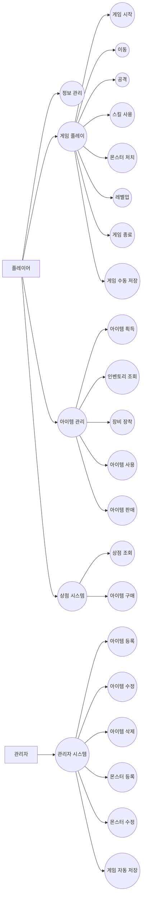

```mermaid
flowchart LR

%% Actor

Player[플레이어]
Admin[관리자]


%% Player Main
Player --> InformationManage((정보 관리))
Player --> GamePlay((게임 플레이))
Player --> ItemManage((아이템 관리))
Player --> ShopSystem((상점 시스템))

%% Game Play
GamePlay --> StartGame((게임 시작))
GamePlay --> Move((이동))
GamePlay --> Attack((공격))
GamePlay --> Skill((스킬 사용))
GamePlay --> KillMonster((몬스터 처치))
GamePlay --> LevelUp((레벨업))
GamePlay --> EndGame((게임 종료))
GamePlay --> StagePassiveSave((게임 수동 저장))

%% Item Manage
ItemManage --> GetItem((아이템 획득))
ItemManage --> Inventory((인벤토리 조회))
ItemManage --> Equip((장비 장착))
ItemManage --> UseItem((아이템 사용))
ItemManage --> SellItem((아이템 판매))

%% Shop
ShopSystem --> ViewShop((상점 조회))
ShopSystem --> BuyItem((아이템 구매))

%% Admin
Admin --> AdminSystem((관리자 시스템))
AdminSystem --> ItemRegister((아이템 등록))
AdminSystem --> ItemEdit((아이템 수정))
AdminSystem --> ItemDelete((아이템 삭제))
AdminSystem --> MonsterRegister((몬스터 등록))
AdminSystem --> MonsterEdit((몬스터 수정))
AdminSystem --> StageAutoSave((게임 자동 저장))
```

*최종 수정: 2026-05-18 | 담당: 김남준(분석가)*
