> **이 다이어그램은 최종 비전 기준입니다.** MVP 구현 범위는 [docs/mvp-spec.md](mvp-spec.md)를 참조하세요.

```mermaid
flowchart LR

%% Actor
Player[플레이어]
Admin[관리자]

%% Player Main
Player --> InformationManage((정보 관리))
Player --> GamePlay((게임 플레이))
Player --> ItemManage((아이템 관리))
Player --> ShopSystem((상점 시스템))
Player --> ScoreSystem((점수 / 랭킹))

%% Information Manage
InformationManage --> Register((회원가입))
InformationManage --> Login((로그인))
InformationManage --> Logout((로그아웃))

%% Game Play
GamePlay --> StartGame((게임 시작))
GamePlay --> Move((이동))
GamePlay --> Attack((공격))
GamePlay --> Skill((스킬 사용))
GamePlay --> KillMonster((몬스터 처치))
GamePlay --> LevelUp((레벨업))
GamePlay --> Checkpoint((체크포인트 재시작))
GamePlay --> Pause((일시정지 / 재개))
GamePlay --> Challenge((도전 과제))
GamePlay --> ManualSave((게임 수동 저장))
GamePlay --> EndGame((게임 종료))

%% Item Manage
ItemManage --> GetItem((아이템 획득))
ItemManage --> Inventory((인벤토리 조회))
ItemManage --> Equip((장비 장착))
ItemManage --> UseItem((아이템 사용))

%% Shop
ShopSystem --> ViewShop((상점 조회))
ShopSystem --> BuyItem((아이템 구매))
ShopSystem --> SellItem((아이템 판매))

%% Score / Ranking
ScoreSystem --> ViewScore((점수 확인))
ScoreSystem --> ViewRanking((랭킹 조회))

%% Admin
Admin --> AdminSystem((관리자 시스템))
AdminSystem --> ItemRegister((아이템 등록))
AdminSystem --> ItemEdit((아이템 수정))
AdminSystem --> ItemDelete((아이템 삭제))
AdminSystem --> MonsterRegister((몬스터 등록))
AdminSystem --> MonsterEdit((몬스터 수정))
AdminSystem --> MonsterDelete((몬스터 삭제))
AdminSystem --> StageAutoSave((게임 자동 저장))
```

---

## 유즈 케이스 명세

---

### UC-01: 회원가입

#### 식별부

| 유스 케이스 이름 | 회원가입 | ID | UC-01 | 중요도 | 상 |
|---|---|---|---|---|---|
| 주 액터 | 플레이어 | 유스 케이스 유형 | 상세, 필수 | | |
| 이해관계자 | 플레이어 – 게임 계정을 생성하여 서비스를 이용하고자 함 | | | | |
| 간략한 설명 | 플레이어가 아이디와 비밀번호를 입력하여 게임 계정을 생성하는 유스 케이스 | | | | |
| 트리거 | 플레이어가 타이틀 화면에서 회원가입을 선택함 | | | | |
| 관계 | 연관: 플레이어 / 포함: - / 일반화: - / 확장: - | | | | |

#### 정상 시나리오 정의부

| 정상 이벤트 흐름 (정상 시나리오) |
|---|
| 1. 플레이어가 타이틀 화면에서 '회원가입'을 선택한다. |
| 2. 시스템이 회원가입 입력 폼(아이디, 비밀번호, 비밀번호 확인)을 표시한다. |
| 3. 플레이어가 아이디, 비밀번호, 비밀번호 확인을 입력한다. |
| 4. 시스템이 입력 정보의 형식 및 중복 여부를 검사한다. |
| 5. 시스템이 새 계정을 생성하고 가입 완료 메시지를 표시한다. |
| 6. 시스템이 로그인 화면으로 이동한다. |

#### 예외 처리 정의부

| 대안 및 예외 흐름 |
|---|
| 4a: 아이디가 이미 존재하는 경우 – 시스템이 중복 오류 메시지를 표시하고 3단계로 돌아간다. |
| 4b: 비밀번호와 비밀번호 확인이 일치하지 않는 경우 – 시스템이 불일치 오류 메시지를 표시하고 3단계로 돌아간다. |
| 4c: 필수 항목이 입력되지 않은 경우 – 시스템이 해당 항목에 오류를 표시하고 3단계로 돌아간다. |
| 4d: 아이디가 허용 형식(영문·숫자 조합)을 벗어난 경우 – 시스템이 형식 오류 메시지를 표시하고 3단계로 돌아간다. |

---

### UC-02: 로그인

#### 식별부

| 유스 케이스 이름 | 로그인 | ID | UC-02 | 중요도 | 상 |
|---|---|---|---|---|---|
| 주 액터 | 플레이어 | 유스 케이스 유형 | 상세, 필수 | | |
| 이해관계자 | 플레이어 – 게임 서비스에 접근하기 위해 인증하고자 함 | | | | |
| 간략한 설명 | 플레이어가 아이디와 비밀번호를 입력하여 시스템에 인증하는 유스 케이스 | | | | |
| 트리거 | 플레이어가 타이틀 화면에서 로그인을 선택함 | | | | |
| 관계 | 연관: 플레이어 / 포함: - / 일반화: - / 확장: - | | | | |

#### 정상 시나리오 정의부

| 정상 이벤트 흐름 (정상 시나리오) |
|---|
| 1. 플레이어가 타이틀 화면에서 '로그인'을 선택한다. |
| 2. 시스템이 아이디/비밀번호 입력 폼을 표시한다. |
| 3. 플레이어가 아이디와 비밀번호를 입력한다. |
| 4. 시스템이 입력 정보를 데이터베이스와 대조하여 검증한다. |
| 5. 시스템이 인증에 성공하고 메인 메뉴 화면으로 이동한다. |

#### 예외 처리 정의부

| 대안 및 예외 흐름 |
|---|
| 3a: 필수 항목이 입력되지 않은 경우 – 시스템이 해당 항목에 오류를 표시하고 3단계로 돌아간다. |
| 4a: 아이디 또는 비밀번호가 일치하지 않는 경우 – 시스템이 인증 실패 메시지를 표시하고 3단계로 돌아간다. |
| 4b: 등록되지 않은 아이디인 경우 – 시스템이 계정 없음 메시지를 표시하고 3단계로 돌아간다. |

---

### UC-03: 로그아웃

#### 식별부

| 유스 케이스 이름 | 로그아웃 | ID | UC-03 | 중요도 | 상 |
|---|---|---|---|---|---|
| 주 액터 | 플레이어 | 유스 케이스 유형 | 상세, 필수 | | |
| 이해관계자 | 플레이어 – 현재 세션을 안전하게 종료하고자 함 | | | | |
| 간략한 설명 | 플레이어가 현재 세션을 종료하고 타이틀 화면으로 이동하는 유스 케이스 | | | | |
| 트리거 | 플레이어가 메뉴에서 로그아웃을 선택함 | | | | |
| 관계 | 연관: 플레이어 / 포함: - / 일반화: - / 확장: - | | | | |

#### 정상 시나리오 정의부

| 정상 이벤트 흐름 (정상 시나리오) |
|---|
| 1. 플레이어가 메뉴에서 '로그아웃'을 선택한다. |
| 2. 시스템이 로그아웃 확인 메시지를 표시한다. |
| 3. 플레이어가 확인을 선택한다. |
| 4. 시스템이 현재 세션을 종료하고 타이틀 화면으로 이동한다. |

#### 예외 처리 정의부

| 대안 및 예외 흐름 |
|---|
| 1a: 게임 진행 중 로그아웃을 시도한 경우 – 시스템이 저장 여부를 확인한 후 로그아웃을 처리한다. |
| 3a: 플레이어가 취소를 선택한 경우 – 시스템이 로그아웃을 중단하고 이전 화면으로 복귀한다. |

---

### UC-04: 게임 시작

#### 식별부

| 유스 케이스 이름 | 게임 시작 | ID | UC-04 | 중요도 | 상 |
|---|---|---|---|---|---|
| 주 액터 | 플레이어 | 유스 케이스 유형 | 상세, 필수 | | |
| 이해관계자 | 플레이어 – 게임을 플레이하고자 함 | | | | |
| 간략한 설명 | 플레이어가 새 게임 또는 이전 저장 데이터를 불러와 게임 스테이지를 시작하는 유스 케이스 | | | | |
| 트리거 | 플레이어가 메인 메뉴에서 게임 시작을 선택함 | | | | |
| 관계 | 연관: 플레이어 / 포함: - / 일반화: - / 확장: - | | | | |

#### 정상 시나리오 정의부

| 정상 이벤트 흐름 (정상 시나리오) |
|---|
| 1. 플레이어가 메인 메뉴에서 '게임 시작'을 선택한다. |
| 2. 시스템이 이전 저장 데이터 유무를 확인한다. |
| 3. 저장 데이터가 존재하면 시스템이 '이어하기' 또는 '새로 시작' 선택지를 표시한다. |
| 4. 플레이어가 원하는 항목을 선택한다. |
| 5. 시스템이 해당 스테이지 데이터를 로드한다. |
| 6. 시스템이 게임 플레이 화면을 표시하고 플레이어 조작을 활성화한다. |

#### 예외 처리 정의부

| 대안 및 예외 흐름 |
|---|
| 2a: 저장 데이터가 없는 경우 – 시스템이 3단계를 건너뛰고 새 게임을 바로 시작한다. |
| 5a: 저장 데이터가 손상된 경우 – 시스템이 오류 안내 메시지를 표시하고 새 게임으로 시작한다. |
| 5b: 스테이지 로드에 실패한 경우 – 시스템이 오류 메시지를 표시하고 메인 메뉴로 복귀한다. |

---

### UC-05: 이동

#### 식별부

| 유스 케이스 이름 | 이동 | ID | UC-05 | 중요도 | 상 |
|---|---|---|---|---|---|
| 주 액터 | 플레이어 | 유스 케이스 유형 | 상세, 필수 | | |
| 이해관계자 | 플레이어 – 캐릭터를 원하는 방향으로 이동시키고자 함 | | | | |
| 간략한 설명 | 플레이어의 키 입력에 따라 캐릭터를 상하좌우로 이동시키는 유스 케이스 | | | | |
| 트리거 | 플레이어가 이동 키(방향키 또는 WASD)를 입력함 | | | | |
| 관계 | 연관: 플레이어 / 포함: - / 일반화: - / 확장: - | | | | |

#### 정상 시나리오 정의부

| 정상 이벤트 흐름 (정상 시나리오) |
|---|
| 1. 플레이어가 방향키(또는 WASD)를 입력한다. |
| 2. 시스템이 입력된 방향의 이동 가능 여부를 판정한다. |
| 3. 시스템이 캐릭터를 해당 방향으로 이동시킨다. |
| 4. 시스템이 이동 애니메이션을 재생한다. |

#### 예외 처리 정의부

| 대안 및 예외 흐름 |
|---|
| 2a: 이동 방향에 벽 또는 장애물이 있는 경우 – 시스템이 이동을 차단하고 현재 위치를 유지한다. |
| 2b: 맵 경계를 초과하는 방향인 경우 – 시스템이 이동을 제한하고 현재 위치를 유지한다. |
| 2c: 캐릭터가 스턴 등 이동 불가 상태인 경우 – 시스템이 입력을 무시한다. |

---

### UC-06: 공격

#### 식별부

| 유스 케이스 이름 | 공격 | ID | UC-06 | 중요도 | 상 |
|---|---|---|---|---|---|
| 주 액터 | 플레이어 | 유스 케이스 유형 | 상세, 필수 | | |
| 이해관계자 | 플레이어 – 적을 공격하여 처치하고자 함 | | | | |
| 간략한 설명 | 플레이어의 공격 키 입력에 따라 캐릭터가 공격을 수행하고 적에게 데미지를 적용하는 유스 케이스 | | | | |
| 트리거 | 플레이어가 공격 키를 입력함 | | | | |
| 관계 | 연관: 플레이어 / 포함: - / 일반화: - / 확장: 몬스터 처치(UC-08) | | | | |

#### 정상 시나리오 정의부

| 정상 이벤트 흐름 (정상 시나리오) |
|---|
| 1. 플레이어가 공격 키를 입력한다. |
| 2. 시스템이 공격 쿨타임 여부를 확인한다. |
| 3. 시스템이 공격 애니메이션을 재생한다. |
| 4. 시스템이 공격 범위 내의 적을 탐색한다. |
| 5. 시스템이 탐색된 적에게 데미지를 적용하고 데미지 수치를 화면에 표시한다. |

#### 예외 처리 정의부

| 대안 및 예외 흐름 |
|---|
| 2a: 공격 쿨타임이 남아있는 경우 – 시스템이 입력을 무시하고 잔여 쿨타임을 UI에 표시한다. |
| 2b: 캐릭터가 공격 불가 상태(스턴 등)인 경우 – 시스템이 입력을 무시한다. |
| 4a: 공격 범위 내에 적이 없는 경우 – 시스템이 공격 애니메이션만 재생하고 데미지를 적용하지 않는다. |

---

### UC-07: 스킬 사용

#### 식별부

| 유스 케이스 이름 | 스킬 사용 | ID | UC-07 | 중요도 | 상 |
|---|---|---|---|---|---|
| 주 액터 | 플레이어 | 유스 케이스 유형 | 상세, 필수 | | |
| 이해관계자 | 플레이어 – 보유한 스킬을 발동하여 전투를 유리하게 이끌고자 함 | | | | |
| 간략한 설명 | 플레이어가 스킬 키를 입력하여 MP를 소모하고 스킬 효과를 발동하는 유스 케이스 | | | | |
| 트리거 | 플레이어가 스킬 키를 입력함 | | | | |
| 관계 | 연관: 플레이어 / 포함: - / 일반화: - / 확장: 몬스터 처치(UC-08) | | | | |

#### 정상 시나리오 정의부

| 정상 이벤트 흐름 (정상 시나리오) |
|---|
| 1. 플레이어가 스킬 키를 입력한다. |
| 2. 시스템이 해당 스킬의 MP 충족 여부와 쿨타임을 확인한다. |
| 3. 시스템이 스킬 발동 애니메이션을 재생한다. |
| 4. 시스템이 스킬 효과(데미지, 버프 등)를 적용한다. |
| 5. 시스템이 스킬에 해당하는 MP를 소모하고 쿨타임을 시작한다. |

#### 예외 처리 정의부

| 대안 및 예외 흐름 |
|---|
| 2a: MP가 부족한 경우 – 시스템이 MP 부족 안내 메시지를 표시하고 스킬을 발동하지 않는다. |
| 2b: 스킬이 쿨타임 중인 경우 – 시스템이 잔여 쿨타임을 UI에 표시하고 발동하지 않는다. |
| 2c: 해당 스킬을 보유하지 않은 경우 – 시스템이 입력을 무시한다. |

---

### UC-08: 몬스터 처치

#### 식별부

| 유스 케이스 이름 | 몬스터 처치 | ID | UC-08 | 중요도 | 상 |
|---|---|---|---|---|---|
| 주 액터 | 플레이어 | 유스 케이스 유형 | 상세, 필수 | | |
| 이해관계자 | 플레이어 – 몬스터를 처치하여 경험치와 아이템을 획득하고자 함 | | | | |
| 간략한 설명 | 플레이어의 공격으로 몬스터의 HP가 0 이하가 되면 몬스터를 처치하고 보상을 지급하는 유스 케이스 | | | | |
| 트리거 | 몬스터의 HP가 0 이하가 됨 | | | | |
| 관계 | 연관: 플레이어 / 포함: - / 일반화: - / 확장: 레벨업(UC-09), 아이템 획득(UC-15) | | | | |

#### 정상 시나리오 정의부

| 정상 이벤트 흐름 (정상 시나리오) |
|---|
| 1. 플레이어의 공격으로 몬스터의 HP가 0 이하가 된다. |
| 2. 시스템이 몬스터 사망 애니메이션 및 이펙트를 재생한다. |
| 3. 시스템이 몬스터에 설정된 경험치를 플레이어에게 지급한다. |
| 4. 시스템이 몬스터 드롭 테이블에 따라 아이템을 바닥에 생성한다. |
| 5. 시스템이 몬스터를 스테이지에서 제거한다. |

#### 예외 처리 정의부

| 대안 및 예외 흐름 |
|---|
| 4a: 드롭 아이템이 없는 경우 – 시스템이 아이템 생성 없이 처치 처리를 완료한다. |
| 5a: 처치된 몬스터가 보스인 경우 – 시스템이 보스 전용 클리어 연출을 재생하고 스테이지 완료를 처리한다. |

---

### UC-09: 레벨업

#### 식별부

| 유스 케이스 이름 | 레벨업 | ID | UC-09 | 중요도 | 상 |
|---|---|---|---|---|---|
| 주 액터 | 플레이어 | 유스 케이스 유형 | 상세, 필수 | | |
| 이해관계자 | 플레이어 – 캐릭터를 성장시켜 더 강한 적을 상대하고자 함 | | | | |
| 간략한 설명 | 누적 경험치가 다음 레벨 임계치에 도달하면 캐릭터 레벨이 상승하고 스탯이 증가하는 유스 케이스 | | | | |
| 트리거 | 플레이어의 누적 경험치가 다음 레벨 기준치에 도달함 | | | | |
| 관계 | 연관: 플레이어 / 포함: - / 일반화: - / 확장: - | | | | |

#### 정상 시나리오 정의부

| 정상 이벤트 흐름 (정상 시나리오) |
|---|
| 1. 경험치 획득으로 누적 경험치가 레벨업 기준치에 도달한다. |
| 2. 시스템이 레벨업 이펙트와 효과음을 재생한다. |
| 3. 시스템이 플레이어 레벨을 1 증가시킨다. |
| 4. 시스템이 HP, MP, 공격력 등 스탯을 레벨업 공식에 따라 자동으로 증가시킨다. |
| 5. 시스템이 레벨업 결과(변경된 스탯)를 UI에 표시한다. |

#### 예외 처리 정의부

| 대안 및 예외 흐름 |
|---|
| 1a: 이미 최대 레벨인 경우 – 시스템이 경험치 획득은 유지하되 레벨업 처리를 생략한다. |
| 1b: 연속으로 레벨업 조건이 충족된 경우 – 시스템이 레벨업을 조건이 만족되지 않을 때까지 반복 처리한다. |

---

### UC-10: 체크포인트 재시작

#### 식별부

| 유스 케이스 이름 | 체크포인트 재시작 | ID | UC-10 | 중요도 | 중 |
|---|---|---|---|---|---|
| 주 액터 | 플레이어 | 유스 케이스 유형 | 상세, 필수 | | |
| 이해관계자 | 플레이어 – 사망 후 게임을 포기하지 않고 근처 지점에서 재개하고자 함 | | | | |
| 간략한 설명 | 플레이어 캐릭터가 사망하면 마지막으로 활성화된 체크포인트에서 부활하는 유스 케이스 | | | | |
| 트리거 | 플레이어 캐릭터의 HP가 0 이하가 됨 | | | | |
| 관계 | 연관: 플레이어 / 포함: - / 일반화: - / 확장: - | | | | |

#### 정상 시나리오 정의부

| 정상 이벤트 흐름 (정상 시나리오) |
|---|
| 1. 플레이어 캐릭터의 HP가 0 이하가 된다. |
| 2. 시스템이 사망 애니메이션을 재생한다. |
| 3. 시스템이 재시작 선택 UI(체크포인트 재시작 / 타이틀로 복귀)를 표시한다. |
| 4. 플레이어가 체크포인트 재시작을 선택한다. |
| 5. 시스템이 마지막으로 활성화된 체크포인트 위치에서 캐릭터를 부활시킨다. |
| 6. 시스템이 캐릭터의 HP를 회복하고 게임을 재개한다. |

#### 예외 처리 정의부

| 대안 및 예외 흐름 |
|---|
| 4a: 활성화된 체크포인트가 없는 경우 – 시스템이 스테이지 시작 지점에서 재시작한다. |
| 4b: 플레이어가 타이틀로 복귀를 선택한 경우 – 시스템이 저장 없이 메인 메뉴로 이동한다. |

---

### UC-11: 일시정지 / 재개

#### 식별부

| 유스 케이스 이름 | 일시정지 / 재개 | ID | UC-11 | 중요도 | 중 |
|---|---|---|---|---|---|
| 주 액터 | 플레이어 | 유스 케이스 유형 | 상세, 필수 | | |
| 이해관계자 | 플레이어 – 게임 진행을 잠시 중단하고 메뉴를 이용하고자 함 | | | | |
| 간략한 설명 | 플레이어가 게임을 일시정지하여 게임 루프를 멈추거나 재개하는 유스 케이스 | | | | |
| 트리거 | 플레이어가 일시정지 키(ESC 등)를 입력함 | | | | |
| 관계 | 연관: 플레이어 / 포함: - / 일반화: - / 확장: 게임 수동 저장(UC-13), 게임 종료(UC-14) | | | | |

#### 정상 시나리오 정의부

| 정상 이벤트 흐름 (정상 시나리오) |
|---|
| 1. 플레이어가 일시정지 키를 입력한다. |
| 2. 시스템이 게임 루프를 정지하고 일시정지 메뉴를 표시한다. |
| 3. 플레이어가 '재개'를 선택한다. |
| 4. 시스템이 일시정지 메뉴를 닫고 게임 루프를 재개한다. |

#### 예외 처리 정의부

| 대안 및 예외 흐름 |
|---|
| 1a: 일시정지가 불가능한 구간(특정 컷씬 등)인 경우 – 시스템이 일시정지 입력을 무시한다. |
| 3a: 플레이어가 '저장'을 선택한 경우 – UC-13(게임 수동 저장)을 수행하고 일시정지 메뉴로 복귀한다. |
| 3b: 플레이어가 '종료'를 선택한 경우 – UC-14(게임 종료)를 수행한다. |

---

### UC-12: 도전 과제

#### 식별부

| 유스 케이스 이름 | 도전 과제 | ID | UC-12 | 중요도 | 중 |
|---|---|---|---|---|---|
| 주 액터 | 플레이어 | 유스 케이스 유형 | 상세, 선택 | | |
| 이해관계자 | 플레이어 – 특정 조건을 달성하여 추가 보상을 획득하고자 함 | | | | |
| 간략한 설명 | 게임 내 특정 조건 달성 시 도전 과제를 완료 처리하고 보상을 지급하는 유스 케이스 | | | | |
| 트리거 | 특정 게임 내 조건이 충족됨 | | | | |
| 관계 | 연관: 플레이어 / 포함: - / 일반화: - / 확장: - | | | | |

#### 정상 시나리오 정의부

| 정상 이벤트 흐름 (정상 시나리오) |
|---|
| 1. 플레이어가 도전 과제 조건을 충족하는 행동을 수행한다. |
| 2. 시스템이 해당 조건의 달성 여부를 판정한다. |
| 3. 시스템이 도전 과제 완료 알림을 화면에 표시한다. |
| 4. 시스템이 보상(경험치, 아이템 등)을 플레이어에게 지급한다. |
| 5. 시스템이 해당 도전 과제를 완료 목록으로 이동한다. |

#### 예외 처리 정의부

| 대안 및 예외 흐름 |
|---|
| 2a: 이미 완료된 도전 과제인 경우 – 시스템이 보상 없이 처리를 무시한다. |
| 2b: 도전 과제 데이터 로드에 실패한 경우 – 시스템이 오류 로그를 기록하고 게임 진행을 계속한다. |

---

### UC-13: 게임 수동 저장

#### 식별부

| 유스 케이스 이름 | 게임 수동 저장 | ID | UC-13 | 중요도 | 상 |
|---|---|---|---|---|---|
| 주 액터 | 플레이어 | 유스 케이스 유형 | 상세, 필수 | | |
| 이해관계자 | 플레이어 – 현재 진행 상황을 보존하고자 함 | | | | |
| 간략한 설명 | 플레이어가 현재 게임 상태를 선택한 저장 슬롯에 직접 저장하는 유스 케이스 | | | | |
| 트리거 | 플레이어가 메뉴에서 게임 저장을 선택함 | | | | |
| 관계 | 연관: 플레이어 / 포함: - / 일반화: - / 확장: - | | | | |

#### 정상 시나리오 정의부

| 정상 이벤트 흐름 (정상 시나리오) |
|---|
| 1. 플레이어가 메뉴에서 '게임 저장'을 선택한다. |
| 2. 시스템이 저장 슬롯 선택 화면을 표시한다. |
| 3. 플레이어가 저장할 슬롯을 선택한다. |
| 4. 시스템이 현재 스테이지, 위치, 인벤토리, 스탯 등 게임 상태를 해당 슬롯에 기록한다. |
| 5. 시스템이 저장 완료 메시지를 표시한다. |

#### 예외 처리 정의부

| 대안 및 예외 흐름 |
|---|
| 1a: 저장이 불가능한 구간(특정 이벤트 중)인 경우 – 시스템이 저장 불가 안내 메시지를 표시한다. |
| 3a: 선택한 슬롯에 기존 저장 데이터가 있는 경우 – 시스템이 덮어쓰기 여부를 확인하고 처리한다. |
| 4a: 저장 중 오류가 발생한 경우 – 시스템이 오류 메시지를 표시하고 재시도를 안내한다. |

---

### UC-14: 게임 종료

#### 식별부

| 유스 케이스 이름 | 게임 종료 | ID | UC-14 | 중요도 | 상 |
|---|---|---|---|---|---|
| 주 액터 | 플레이어 | 유스 케이스 유형 | 상세, 필수 | | |
| 이해관계자 | 플레이어 – 게임 애플리케이션을 안전하게 종료하고자 함 | | | | |
| 간략한 설명 | 플레이어가 게임을 종료하면 리소스를 정리하고 애플리케이션을 닫는 유스 케이스 | | | | |
| 트리거 | 플레이어가 메뉴에서 게임 종료를 선택함 | | | | |
| 관계 | 연관: 플레이어 / 포함: - / 일반화: - / 확장: - | | | | |

#### 정상 시나리오 정의부

| 정상 이벤트 흐름 (정상 시나리오) |
|---|
| 1. 플레이어가 메뉴에서 '게임 종료'를 선택한다. |
| 2. 시스템이 종료 확인 메시지를 표시한다. |
| 3. 플레이어가 확인을 선택한다. |
| 4. 시스템이 리소스를 정리하고 애플리케이션을 종료한다. |

#### 예외 처리 정의부

| 대안 및 예외 흐름 |
|---|
| 2a: 저장되지 않은 진행 상황이 있는 경우 – 시스템이 저장 여부를 먼저 확인한 후 종료 처리한다. |
| 3a: 플레이어가 취소를 선택한 경우 – 시스템이 종료를 중단하고 이전 화면으로 복귀한다. |

---

### UC-15: 아이템 획득

#### 식별부

| 유스 케이스 이름 | 아이템 획득 | ID | UC-15 | 중요도 | 상 |
|---|---|---|---|---|---|
| 주 액터 | 플레이어 | 유스 케이스 유형 | 상세, 필수 | | |
| 이해관계자 | 플레이어 – 맵에 떨어진 아이템을 수집하여 능력을 강화하고자 함 | | | | |
| 간략한 설명 | 플레이어가 맵 위의 아이템에 접근하거나 획득 키를 입력하여 인벤토리에 추가하는 유스 케이스 | | | | |
| 트리거 | 플레이어 캐릭터가 아이템과 접촉하거나 획득 키를 입력함 | | | | |
| 관계 | 연관: 플레이어 / 포함: - / 일반화: - / 확장: - | | | | |

#### 정상 시나리오 정의부

| 정상 이벤트 흐름 (정상 시나리오) |
|---|
| 1. 플레이어가 맵에 존재하는 아이템 근처로 이동한다. |
| 2. 시스템이 아이템 획득 가능 상태(범위 내 접근)를 감지한다. |
| 3. 플레이어가 획득 키를 입력하거나 자동 획득이 발동된다. |
| 4. 시스템이 해당 아이템을 플레이어의 인벤토리에 추가한다. |
| 5. 시스템이 획득 알림과 아이템 정보를 화면에 표시한다. |

#### 예외 처리 정의부

| 대안 및 예외 흐름 |
|---|
| 4a: 인벤토리가 가득 찬 경우 – 시스템이 획득 불가 안내 메시지를 표시한다. |
| 4b: 동일 아이템의 최대 보유 수량을 초과한 경우 – 시스템이 초과 안내 메시지를 표시하고 획득을 거부한다. |

---

### UC-16: 인벤토리 조회

#### 식별부

| 유스 케이스 이름 | 인벤토리 조회 | ID | UC-16 | 중요도 | 상 |
|---|---|---|---|---|---|
| 주 액터 | 플레이어 | 유스 케이스 유형 | 상세, 필수 | | |
| 이해관계자 | 플레이어 – 보유 아이템 목록을 확인하고 관리하고자 함 | | | | |
| 간략한 설명 | 플레이어가 인벤토리 키를 입력하여 보유 아이템 목록 및 상세 정보를 조회하는 유스 케이스 | | | | |
| 트리거 | 플레이어가 인벤토리 키를 입력함 | | | | |
| 관계 | 연관: 플레이어 / 포함: - / 일반화: - / 확장: 장비 장착(UC-17), 아이템 사용(UC-18) | | | | |

#### 정상 시나리오 정의부

| 정상 이벤트 흐름 (정상 시나리오) |
|---|
| 1. 플레이어가 인벤토리 키를 입력한다. |
| 2. 시스템이 게임을 일시정지하고 인벤토리 UI를 표시한다. |
| 3. 플레이어가 보유 아이템 목록을 확인한다. |
| 4. 플레이어가 특정 아이템을 선택하면 시스템이 상세 정보를 표시한다. |
| 5. 플레이어가 인벤토리를 닫으면 시스템이 게임을 재개한다. |

#### 예외 처리 정의부

| 대안 및 예외 흐름 |
|---|
| 1a: 인벤토리를 열 수 없는 구간(특정 컷씬 등)인 경우 – 시스템이 열기 불가 안내 메시지를 표시한다. |
| 3a: 인벤토리가 비어있는 경우 – 시스템이 빈 인벤토리 안내 메시지를 표시한다. |
| 4a: 플레이어가 아이템 사용을 선택한 경우 – UC-18(아이템 사용)을 수행한다. |
| 4b: 플레이어가 장비 장착을 선택한 경우 – UC-17(장비 장착)을 수행한다. |

---

### UC-17: 장비 장착

#### 식별부

| 유스 케이스 이름 | 장비 장착 | ID | UC-17 | 중요도 | 중 |
|---|---|---|---|---|---|
| 주 액터 | 플레이어 | 유스 케이스 유형 | 상세, 필수 | | |
| 이해관계자 | 플레이어 – 보유한 장비를 캐릭터에 착용하여 스탯을 강화하고자 함 | | | | |
| 간략한 설명 | 플레이어가 인벤토리에서 장비 아이템을 선택하여 캐릭터에 장착하고 스탯을 갱신하는 유스 케이스 | | | | |
| 트리거 | 플레이어가 인벤토리에서 장비 아이템의 장착을 요청함 | | | | |
| 관계 | 연관: 플레이어 / 포함: 인벤토리 조회(UC-16) / 일반화: - / 확장: - | | | | |

#### 정상 시나리오 정의부

| 정상 이벤트 흐름 (정상 시나리오) |
|---|
| 1. 플레이어가 인벤토리에서 장비 아이템을 선택한다. |
| 2. 시스템이 해당 아이템의 장착 가능 여부(레벨, 직업 조건)를 확인한다. |
| 3. 플레이어가 '장착'을 선택한다. |
| 4. 기존 해당 슬롯에 장착된 장비가 있으면 시스템이 이를 인벤토리로 이동한다. |
| 5. 시스템이 선택한 장비를 해당 슬롯에 장착하고 캐릭터 스탯을 갱신한다. |

#### 예외 처리 정의부

| 대안 및 예외 흐름 |
|---|
| 2a: 캐릭터의 레벨이 장착 조건에 미달하는 경우 – 시스템이 레벨 조건 안내 메시지를 표시한다. |
| 4a: 교체 시 인벤토리가 가득 찬 경우 – 시스템이 공간 부족 안내 메시지를 표시하고 장착을 취소한다. |

---

### UC-18: 아이템 사용

#### 식별부

| 유스 케이스 이름 | 아이템 사용 | ID | UC-18 | 중요도 | 상 |
|---|---|---|---|---|---|
| 주 액터 | 플레이어 | 유스 케이스 유형 | 상세, 필수 | | |
| 이해관계자 | 플레이어 – 소비 아이템을 사용하여 HP 회복 등의 효과를 얻고자 함 | | | | |
| 간략한 설명 | 플레이어가 인벤토리에서 소비 아이템을 선택하여 효과를 발동하고 수량을 소모하는 유스 케이스 | | | | |
| 트리거 | 플레이어가 인벤토리에서 아이템 사용을 요청함 | | | | |
| 관계 | 연관: 플레이어 / 포함: 인벤토리 조회(UC-16) / 일반화: - / 확장: - | | | | |

#### 정상 시나리오 정의부

| 정상 이벤트 흐름 (정상 시나리오) |
|---|
| 1. 플레이어가 인벤토리에서 사용할 아이템을 선택한다. |
| 2. 시스템이 해당 아이템의 사용 가능 여부를 확인한다. |
| 3. 플레이어가 '사용'을 선택한다. |
| 4. 시스템이 아이템 효과(HP 회복 등)를 캐릭터에 적용한다. |
| 5. 시스템이 아이템 수량을 1 감소시키고, 수량이 0이 되면 인벤토리에서 제거한다. |

#### 예외 처리 정의부

| 대안 및 예외 흐름 |
|---|
| 2a: 사용이 불가한 상태(특정 디버프 등)인 경우 – 시스템이 사용 불가 안내 메시지를 표시한다. |
| 4a: 이미 HP가 최대치인 경우 – 시스템이 효과 없음 안내 메시지를 표시하고 아이템을 소모하지 않는다. |

---

### UC-19: 상점 조회

#### 식별부

| 유스 케이스 이름 | 상점 조회 | ID | UC-19 | 중요도 | 중 |
|---|---|---|---|---|---|
| 주 액터 | 플레이어 | 유스 케이스 유형 | 상세, 필수 | | |
| 이해관계자 | 플레이어 – 구매 가능한 아이템 목록과 가격을 확인하고자 함 | | | | |
| 간략한 설명 | 플레이어가 상점 NPC와 상호작용하여 판매 아이템 목록을 조회하는 유스 케이스 | | | | |
| 트리거 | 플레이어가 상점 NPC에 접근하여 상호작용함 | | | | |
| 관계 | 연관: 플레이어 / 포함: - / 일반화: - / 확장: 아이템 구매(UC-20), 아이템 판매(UC-21) | | | | |

#### 정상 시나리오 정의부

| 정상 이벤트 흐름 (정상 시나리오) |
|---|
| 1. 플레이어가 상점 NPC에 접근하여 상호작용 키를 입력한다. |
| 2. 시스템이 상점 UI를 열고 판매 중인 아이템 목록과 가격을 표시한다. |
| 3. 플레이어가 아이템을 선택하면 시스템이 아이템 상세 정보와 가격을 표시한다. |
| 4. 플레이어가 구매, 판매 또는 상점 닫기를 선택한다. |

#### 예외 처리 정의부

| 대안 및 예외 흐름 |
|---|
| 2a: 상점 데이터 로드에 실패한 경우 – 시스템이 오류 메시지를 표시하고 상점 접근을 거부한다. |
| 2b: 판매 중인 아이템이 없는 경우 – 시스템이 빈 상점 안내 메시지를 표시한다. |
| 4a: 플레이어가 구매를 선택한 경우 – UC-20(아이템 구매)을 수행한다. |
| 4b: 플레이어가 판매를 선택한 경우 – UC-21(아이템 판매)을 수행한다. |

---

### UC-20: 아이템 구매

#### 식별부

| 유스 케이스 이름 | 아이템 구매 | ID | UC-20 | 중요도 | 중 |
|---|---|---|---|---|---|
| 주 액터 | 플레이어 | 유스 케이스 유형 | 상세, 필수 | | |
| 이해관계자 | 플레이어 – 골드를 지불하고 필요한 아이템을 구매하고자 함 | | | | |
| 간략한 설명 | 플레이어가 상점에서 아이템을 선택하여 골드를 지불하고 인벤토리에 추가하는 유스 케이스 | | | | |
| 트리거 | 플레이어가 상점에서 아이템 구매를 선택함 | | | | |
| 관계 | 연관: 플레이어 / 포함: 상점 조회(UC-19) / 일반화: - / 확장: - | | | | |

#### 정상 시나리오 정의부

| 정상 이벤트 흐름 (정상 시나리오) |
|---|
| 1. 플레이어가 상점에서 구매할 아이템을 선택한다. |
| 2. 시스템이 플레이어의 보유 골드와 아이템 가격을 비교한다. |
| 3. 시스템이 구매 확인 창(아이템 이름, 가격, 보유 골드)을 표시한다. |
| 4. 플레이어가 확인을 선택한다. |
| 5. 시스템이 골드를 차감하고 아이템을 인벤토리에 추가한다. |

#### 예외 처리 정의부

| 대안 및 예외 흐름 |
|---|
| 2a: 보유 골드가 아이템 가격보다 적은 경우 – 시스템이 골드 부족 안내 메시지를 표시하고 구매를 거부한다. |
| 4a: 인벤토리가 가득 찬 경우 – 시스템이 공간 부족 안내 메시지를 표시하고 구매를 거부한다. |
| 4b: 플레이어가 취소를 선택한 경우 – 시스템이 구매를 중단하고 상점 화면으로 복귀한다. |

---

### UC-21: 아이템 판매

#### 식별부

| 유스 케이스 이름 | 아이템 판매 | ID | UC-21 | 중요도 | 중 |
|---|---|---|---|---|---|
| 주 액터 | 플레이어 | 유스 케이스 유형 | 상세, 필수 | | |
| 이해관계자 | 플레이어 – 불필요한 아이템을 골드로 전환하고자 함 | | | | |
| 간략한 설명 | 플레이어가 상점에서 인벤토리의 아이템을 판매하여 골드를 획득하는 유스 케이스 | | | | |
| 트리거 | 플레이어가 상점에서 아이템 판매를 선택함 | | | | |
| 관계 | 연관: 플레이어 / 포함: 상점 조회(UC-19) / 일반화: - / 확장: - | | | | |

#### 정상 시나리오 정의부

| 정상 이벤트 흐름 (정상 시나리오) |
|---|
| 1. 플레이어가 상점에서 '판매' 탭을 선택한다. |
| 2. 시스템이 인벤토리의 판매 가능한 아이템 목록을 표시한다. |
| 3. 플레이어가 판매할 아이템을 선택한다. |
| 4. 시스템이 판매 가격과 확인 창을 표시한다. |
| 5. 플레이어가 확인을 선택한다. |
| 6. 시스템이 아이템을 인벤토리에서 제거하고 골드를 지급한다. |

#### 예외 처리 정의부

| 대안 및 예외 흐름 |
|---|
| 3a: 판매 불가 아이템을 선택한 경우 – 시스템이 판매 불가 안내 메시지를 표시한다. |
| 3b: 현재 장착 중인 아이템을 판매하려는 경우 – 시스템이 장착 해제 후 판매 여부를 확인한다. |
| 5a: 플레이어가 취소를 선택한 경우 – 시스템이 판매를 중단하고 상점 화면으로 복귀한다. |

---

### UC-22: 점수 확인

#### 식별부

| 유스 케이스 이름 | 점수 확인 | ID | UC-22 | 중요도 | 중 |
|---|---|---|---|---|---|
| 주 액터 | 플레이어 | 유스 케이스 유형 | 상세, 선택 | | |
| 이해관계자 | 플레이어 – 자신의 게임 점수 현황을 파악하고자 함 | | | | |
| 간략한 설명 | 플레이어가 자신의 스테이지별 점수 및 총 점수를 조회하는 유스 케이스 | | | | |
| 트리거 | 플레이어가 메뉴에서 점수 확인을 선택함 | | | | |
| 관계 | 연관: 플레이어 / 포함: - / 일반화: - / 확장: 랭킹 조회(UC-23) | | | | |

#### 정상 시나리오 정의부

| 정상 이벤트 흐름 (정상 시나리오) |
|---|
| 1. 플레이어가 메뉴에서 '점수 확인'을 선택한다. |
| 2. 시스템이 해당 플레이어의 점수 데이터를 조회한다. |
| 3. 시스템이 스테이지별 점수와 총 점수를 화면에 표시한다. |

#### 예외 처리 정의부

| 대안 및 예외 흐름 |
|---|
| 2a: 점수 기록이 없는 경우 – 시스템이 점수 기록 없음 안내 메시지를 표시한다. |
| 2b: 데이터 조회에 실패한 경우 – 시스템이 오류 메시지를 표시하고 재시도를 안내한다. |

---

### UC-23: 랭킹 조회

#### 식별부

| 유스 케이스 이름 | 랭킹 조회 | ID | UC-23 | 중요도 | 중 |
|---|---|---|---|---|---|
| 주 액터 | 플레이어 | 유스 케이스 유형 | 상세, 선택 | | |
| 이해관계자 | 플레이어 – 자신의 순위와 다른 플레이어의 점수를 비교하고자 함 | | | | |
| 간략한 설명 | 플레이어가 전체 또는 특정 스테이지의 점수 랭킹을 조회하는 유스 케이스 | | | | |
| 트리거 | 플레이어가 메뉴에서 랭킹 조회를 선택함 | | | | |
| 관계 | 연관: 플레이어 / 포함: - / 일반화: - / 확장: - | | | | |

#### 정상 시나리오 정의부

| 정상 이벤트 흐름 (정상 시나리오) |
|---|
| 1. 플레이어가 메뉴에서 '랭킹 조회'를 선택한다. |
| 2. 시스템이 랭킹 데이터를 조회한다. |
| 3. 시스템이 순위, 닉네임, 점수를 목록 형태로 표시한다. |
| 4. 시스템이 플레이어 본인의 순위를 강조 표시한다. |

#### 예외 처리 정의부

| 대안 및 예외 흐름 |
|---|
| 2a: 랭킹 데이터가 없는 경우 – 시스템이 랭킹 없음 안내 메시지를 표시한다. |
| 2b: 데이터 조회에 실패한 경우 – 시스템이 오류 메시지를 표시하고 재시도를 안내한다. |

---

### UC-24: 아이템 등록 (관리자)

#### 식별부

| 유스 케이스 이름 | 아이템 등록 | ID | UC-24 | 중요도 | 상 |
|---|---|---|---|---|---|
| 주 액터 | 관리자 | 유스 케이스 유형 | 상세, 필수 | | |
| 이해관계자 | 관리자 – 게임 내 아이템 콘텐츠를 추가하여 서비스를 유지·발전시키고자 함 | | | | |
| 간략한 설명 | 관리자가 새 아이템의 정보를 입력하여 게임 데이터베이스에 등록하는 유스 케이스 | | | | |
| 트리거 | 관리자가 관리자 시스템에서 아이템 등록을 선택함 | | | | |
| 관계 | 연관: 관리자 / 포함: - / 일반화: - / 확장: - | | | | |

#### 정상 시나리오 정의부

| 정상 이벤트 흐름 (정상 시나리오) |
|---|
| 1. 관리자가 관리자 시스템에서 '아이템 등록'을 선택한다. |
| 2. 시스템이 아이템 정보 입력 폼을 표시한다. |
| 3. 관리자가 아이템 이름, 종류, 스탯 수치, 가격 등의 정보를 입력한다. |
| 4. 시스템이 입력 정보의 유효성 및 ID 중복 여부를 검사한다. |
| 5. 시스템이 새 아이템을 데이터베이스에 등록하고 완료 메시지를 표시한다. |

#### 예외 처리 정의부

| 대안 및 예외 흐름 |
|---|
| 4a: 이미 존재하는 아이템 ID를 입력한 경우 – 시스템이 중복 오류 메시지를 표시하고 3단계로 돌아간다. |
| 4b: 필수 항목이 입력되지 않은 경우 – 시스템이 해당 항목에 오류를 표시하고 3단계로 돌아간다. |
| 4c: 유효하지 않은 값(음수 스탯 등)이 입력된 경우 – 시스템이 형식 오류 메시지를 표시하고 3단계로 돌아간다. |

---

### UC-25: 아이템 수정 (관리자)

#### 식별부

| 유스 케이스 이름 | 아이템 수정 | ID | UC-25 | 중요도 | 상 |
|---|---|---|---|---|---|
| 주 액터 | 관리자 | 유스 케이스 유형 | 상세, 필수 | | |
| 이해관계자 | 관리자 – 기존 아이템의 밸런스나 정보를 수정하여 게임 품질을 유지하고자 함 | | | | |
| 간략한 설명 | 관리자가 기존 아이템을 선택하여 정보를 변경하고 데이터베이스에 반영하는 유스 케이스 | | | | |
| 트리거 | 관리자가 관리자 시스템에서 아이템 수정을 선택함 | | | | |
| 관계 | 연관: 관리자 / 포함: - / 일반화: - / 확장: - | | | | |

#### 정상 시나리오 정의부

| 정상 이벤트 흐름 (정상 시나리오) |
|---|
| 1. 관리자가 아이템 목록에서 수정할 아이템을 선택한다. |
| 2. 시스템이 해당 아이템의 현재 정보를 입력 폼에 불러온다. |
| 3. 관리자가 수정할 항목을 변경한다. |
| 4. 관리자가 저장을 요청한다. |
| 5. 시스템이 수정 내용을 검증하고 데이터베이스에 반영한다. |
| 6. 시스템이 수정 완료 메시지를 표시한다. |

#### 예외 처리 정의부

| 대안 및 예외 흐름 |
|---|
| 5a: 유효하지 않은 값이 입력된 경우 – 시스템이 형식 오류 메시지를 표시하고 3단계로 돌아간다. |
| 5b: 저장 중 데이터 충돌이 발생한 경우 – 시스템이 오류 메시지를 표시하고 재시도를 안내한다. |

---

### UC-26: 아이템 삭제 (관리자)

#### 식별부

| 유스 케이스 이름 | 아이템 삭제 | ID | UC-26 | 중요도 | 상 |
|---|---|---|---|---|---|
| 주 액터 | 관리자 | 유스 케이스 유형 | 상세, 필수 | | |
| 이해관계자 | 관리자 – 불필요하거나 잘못 등록된 아이템을 제거하고자 함 | | | | |
| 간략한 설명 | 관리자가 아이템 목록에서 특정 아이템을 선택하여 데이터베이스에서 삭제하는 유스 케이스 | | | | |
| 트리거 | 관리자가 관리자 시스템에서 아이템 삭제를 요청함 | | | | |
| 관계 | 연관: 관리자 / 포함: - / 일반화: - / 확장: - | | | | |

#### 정상 시나리오 정의부

| 정상 이벤트 흐름 (정상 시나리오) |
|---|
| 1. 관리자가 아이템 목록에서 삭제할 아이템을 선택한다. |
| 2. 시스템이 삭제 확인 메시지를 표시한다. |
| 3. 관리자가 확인을 선택한다. |
| 4. 시스템이 해당 아이템을 데이터베이스에서 삭제한다. |
| 5. 시스템이 삭제 완료 메시지를 표시한다. |

#### 예외 처리 정의부

| 대안 및 예외 흐름 |
|---|
| 2a: 삭제 대상 아이템을 현재 보유 중인 플레이어가 있는 경우 – 시스템이 해당 사실을 안내하고 삭제 여부를 재확인한다. |
| 3a: 관리자가 취소를 선택한 경우 – 시스템이 삭제를 중단하고 목록 화면을 유지한다. |

---

### UC-27: 몬스터 등록 (관리자)

#### 식별부

| 유스 케이스 이름 | 몬스터 등록 | ID | UC-27 | 중요도 | 상 |
|---|---|---|---|---|---|
| 주 액터 | 관리자 | 유스 케이스 유형 | 상세, 필수 | | |
| 이해관계자 | 관리자 – 새로운 몬스터 콘텐츠를 추가하여 게임 다양성을 높이고자 함 | | | | |
| 간략한 설명 | 관리자가 새 몬스터의 정보를 입력하여 게임 데이터베이스에 등록하는 유스 케이스 | | | | |
| 트리거 | 관리자가 관리자 시스템에서 몬스터 등록을 선택함 | | | | |
| 관계 | 연관: 관리자 / 포함: - / 일반화: - / 확장: - | | | | |

#### 정상 시나리오 정의부

| 정상 이벤트 흐름 (정상 시나리오) |
|---|
| 1. 관리자가 관리자 시스템에서 '몬스터 등록'을 선택한다. |
| 2. 시스템이 몬스터 정보 입력 폼을 표시한다. |
| 3. 관리자가 몬스터 이름, HP, 공격력, 드롭 아이템 등의 정보를 입력한다. |
| 4. 시스템이 입력 정보의 유효성 및 ID 중복 여부를 검사한다. |
| 5. 시스템이 새 몬스터를 데이터베이스에 등록하고 완료 메시지를 표시한다. |

#### 예외 처리 정의부

| 대안 및 예외 흐름 |
|---|
| 4a: 이미 존재하는 몬스터 ID를 입력한 경우 – 시스템이 중복 오류 메시지를 표시하고 3단계로 돌아간다. |
| 4b: 필수 항목이 입력되지 않은 경우 – 시스템이 해당 항목에 오류를 표시하고 3단계로 돌아간다. |
| 4c: 유효하지 않은 값(음수 HP 등)이 입력된 경우 – 시스템이 형식 오류 메시지를 표시하고 3단계로 돌아간다. |

---

### UC-28: 몬스터 수정 (관리자)

#### 식별부

| 유스 케이스 이름 | 몬스터 수정 | ID | UC-28 | 중요도 | 상 |
|---|---|---|---|---|---|
| 주 액터 | 관리자 | 유스 케이스 유형 | 상세, 필수 | | |
| 이해관계자 | 관리자 – 기존 몬스터의 밸런스나 정보를 수정하여 게임 품질을 유지하고자 함 | | | | |
| 간략한 설명 | 관리자가 기존 몬스터를 선택하여 정보를 변경하고 데이터베이스에 반영하는 유스 케이스 | | | | |
| 트리거 | 관리자가 관리자 시스템에서 몬스터 수정을 선택함 | | | | |
| 관계 | 연관: 관리자 / 포함: - / 일반화: - / 확장: - | | | | |

#### 정상 시나리오 정의부

| 정상 이벤트 흐름 (정상 시나리오) |
|---|
| 1. 관리자가 몬스터 목록에서 수정할 몬스터를 선택한다. |
| 2. 시스템이 해당 몬스터의 현재 정보를 입력 폼에 불러온다. |
| 3. 관리자가 수정할 항목을 변경한다. |
| 4. 관리자가 저장을 요청한다. |
| 5. 시스템이 수정 내용을 검증하고 데이터베이스에 반영한다. |
| 6. 시스템이 수정 완료 메시지를 표시한다. |

#### 예외 처리 정의부

| 대안 및 예외 흐름 |
|---|
| 5a: 유효하지 않은 값이 입력된 경우 – 시스템이 형식 오류 메시지를 표시하고 3단계로 돌아간다. |
| 5b: 저장 중 데이터 충돌이 발생한 경우 – 시스템이 오류 메시지를 표시하고 재시도를 안내한다. |

---

### UC-29: 몬스터 삭제 (관리자)

#### 식별부

| 유스 케이스 이름 | 몬스터 삭제 | ID | UC-29 | 중요도 | 상 |
|---|---|---|---|---|---|
| 주 액터 | 관리자 | 유스 케이스 유형 | 상세, 필수 | | |
| 이해관계자 | 관리자 – 불필요하거나 잘못 등록된 몬스터를 제거하고자 함 | | | | |
| 간략한 설명 | 관리자가 몬스터 목록에서 특정 몬스터를 선택하여 데이터베이스에서 삭제하는 유스 케이스 | | | | |
| 트리거 | 관리자가 관리자 시스템에서 몬스터 삭제를 요청함 | | | | |
| 관계 | 연관: 관리자 / 포함: - / 일반화: - / 확장: - | | | | |

#### 정상 시나리오 정의부

| 정상 이벤트 흐름 (정상 시나리오) |
|---|
| 1. 관리자가 몬스터 목록에서 삭제할 몬스터를 선택한다. |
| 2. 시스템이 삭제 확인 메시지를 표시한다. |
| 3. 관리자가 확인을 선택한다. |
| 4. 시스템이 해당 몬스터를 데이터베이스에서 삭제한다. |
| 5. 시스템이 삭제 완료 메시지를 표시한다. |

#### 예외 처리 정의부

| 대안 및 예외 흐름 |
|---|
| 2a: 삭제 대상 몬스터가 현재 스테이지에 배치되어 있는 경우 – 시스템이 해당 사실을 안내하고 삭제 여부를 재확인한다. |
| 3a: 관리자가 취소를 선택한 경우 – 시스템이 삭제를 중단하고 목록 화면을 유지한다. |

---

### UC-30: 게임 자동 저장 (관리자)

#### 식별부

| 유스 케이스 이름 | 게임 자동 저장 | ID | UC-30 | 중요도 | 상 |
|---|---|---|---|---|---|
| 주 액터 | 관리자 | 유스 케이스 유형 | 상세, 필수 | | |
| 이해관계자 | 관리자 – 모든 플레이어의 진행 상황을 주기적으로 보존하여 데이터 손실을 방지하고자 함 | | | | |
| 간략한 설명 | 설정된 주기에 따라 또는 관리자가 직접 실행하여 모든 플레이어의 게임 상태를 서버에 저장하는 유스 케이스 | | | | |
| 트리거 | 자동 저장 주기가 도래하거나 관리자가 수동으로 자동 저장을 실행함 | | | | |
| 관계 | 연관: 관리자 / 포함: - / 일반화: - / 확장: - | | | | |

#### 정상 시나리오 정의부

| 정상 이벤트 흐름 (정상 시나리오) |
|---|
| 1. 자동 저장 주기가 도래하거나 관리자가 자동 저장을 실행한다. |
| 2. 시스템이 현재 접속 중인 모든 플레이어의 게임 상태를 수집한다. |
| 3. 시스템이 수집한 데이터를 서버 저장소에 기록한다. |
| 4. 시스템이 저장 완료 로그를 관리자 시스템에 기록한다. |

#### 예외 처리 정의부

| 대안 및 예외 흐름 |
|---|
| 3a: 저장 중 서버 오류가 발생한 경우 – 시스템이 오류 로그를 기록하고 관리자에게 알림을 발송한 후 재시도한다. |
| 3b: 일부 플레이어 데이터 저장에 실패한 경우 – 시스템이 실패 대상 목록을 로그에 기록하고 해당 항목만 재시도한다. |

---

*최종 수정: 2026-06-16 | 담당: 김남준(분석가)*
