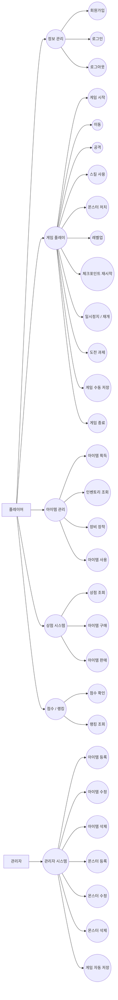

> **이 다이어그램은 최종 비전 기준입니다.** MVP 구현 범위는 [docs/mvp-spec.md](mvp-spec.md)를 참조하세요.

```mermaid
flowchart LR

%% Actor
Player[플레이어]
Admin[관리자]

%% Player Main
Player --> InformationManage((정보 관리))
Player --> GamePlay((게임 플레이))
Player --> ItemManage((아이템 관리))
Player --> ShopSystem((상점 시스템))
Player --> ScoreSystem((점수 / 랭킹))

%% Information Manage
InformationManage --> Register((회원가입))
InformationManage --> Login((로그인))
InformationManage --> Logout((로그아웃))

%% Game Play
GamePlay --> StartGame((게임 시작))
GamePlay --> Move((이동))
GamePlay --> Attack((공격))
GamePlay --> Skill((스킬 사용))
GamePlay --> KillMonster((몬스터 처치))
GamePlay --> LevelUp((레벨업))
GamePlay --> Checkpoint((체크포인트 재시작))
GamePlay --> Pause((일시정지 / 재개))
GamePlay --> Challenge((도전 과제))
GamePlay --> ManualSave((게임 수동 저장))
GamePlay --> EndGame((게임 종료))

%% Item Manage
ItemManage --> GetItem((아이템 획득))
ItemManage --> Inventory((인벤토리 조회))
ItemManage --> Equip((장비 장착))
ItemManage --> UseItem((아이템 사용))

%% Shop
ShopSystem --> ViewShop((상점 조회))
ShopSystem --> BuyItem((아이템 구매))
ShopSystem --> SellItem((아이템 판매))

%% Score / Ranking
ScoreSystem --> ViewScore((점수 확인))
ScoreSystem --> ViewRanking((랭킹 조회))

%% Admin
Admin --> AdminSystem((관리자 시스템))
AdminSystem --> ItemRegister((아이템 등록))
AdminSystem --> ItemEdit((아이템 수정))
AdminSystem --> ItemDelete((아이템 삭제))
AdminSystem --> MonsterRegister((몬스터 등록))
AdminSystem --> MonsterEdit((몬스터 수정))
AdminSystem --> MonsterDelete((몬스터 삭제))
AdminSystem --> StageAutoSave((게임 자동 저장))
```

*최종 수정: 2026-06-02 | 담당: 김남준(분석가)*
