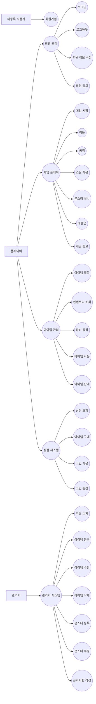

```mermaid
flowchart LR

%% Actor
Guest[미등록 사용자]
Player[플레이어]
Admin[관리자]

%% Guest
Guest --> Signup((회원가입))

%% Player Main
Player --> MemberManage((회원 관리))
Player --> GamePlay((게임 플레이))
Player --> ItemManage((아이템 관리))
Player --> ShopSystem((상점 시스템))

%% Member Manage
MemberManage --> Login((로그인))
MemberManage --> Logout((로그아웃))
MemberManage --> EditProfile((회원 정보 수정))
MemberManage --> Withdraw((회원 탈퇴))

%% Game Play
GamePlay --> StartGame((게임 시작))
GamePlay --> Move((이동))
GamePlay --> Attack((공격))
GamePlay --> Skill((스킬 사용))
GamePlay --> KillMonster((몬스터 처치))
GamePlay --> LevelUp((레벨업))
GamePlay --> EndGame((게임 종료))

%% Item Manage
ItemManage --> GetItem((아이템 획득))
ItemManage --> Inventory((인벤토리 조회))
ItemManage --> Equip((장비 장착))
ItemManage --> UseItem((아이템 사용))
ItemManage --> SellItem((아이템 판매))

%% Shop
ShopSystem --> ViewShop((상점 조회))
ShopSystem --> BuyItem((아이템 구매))
ShopSystem --> UseCoin((코인 사용))
ShopSystem --> ChargeCoin((코인 충전))

%% Admin
Admin --> AdminSystem((관리자 시스템))

AdminSystem --> UserCheck((회원 조회))
AdminSystem --> ItemRegister((아이템 등록))
AdminSystem --> ItemEdit((아이템 수정))
AdminSystem --> ItemDelete((아이템 삭제))
AdminSystem --> MonsterRegister((몬스터 등록))
AdminSystem --> MonsterEdit((몬스터 수정))
AdminSystem --> Notice((공지사항 작성))
```
